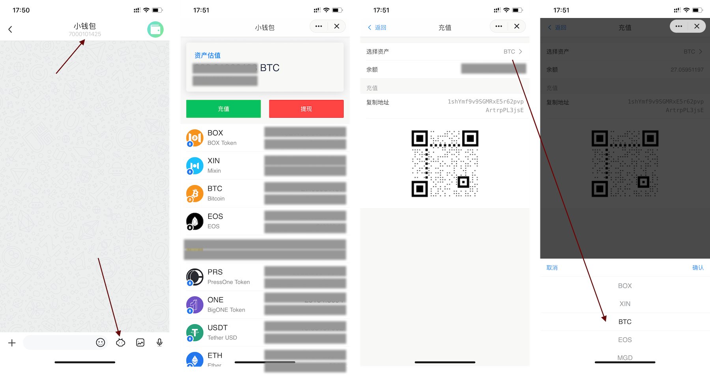

## 4.如何加入BOX定投践行群

### 4.1下载Mixin Messager

Mixin下载方式：

> - ios
> - - 国内用户，在iTunes[下载Mixin畅聊版](https://apps.apple.com/cn/app/mixin-%E5%AF%86%E4%BF%A1%E7%95%85%E8%81%8A%E7%89%88/id1457938019)
>   - 国外用户，在iTunes[下载Mixim Messager](https://apps.apple.com/app/mixin/id1322324266)
> - Android
> - - 国内用户，在[腾讯应用宝下载](https://a.app.qq.com/o/simple.jsp?pkgname=one.mixin.messenger)，或者[小米应用商店下载](http://app.mi.com/details?id=one.mixin.messenger)
>   - 国外用户，在[Google Play Store下载](https://play.google.com/store/apps/details?id=one.mixin.messenger)

iOS国内用户下载的[Mixin畅聊版](https://apps.apple.com/cn/app/mixin-%E5%AF%86%E4%BF%A1%E7%95%85%E8%81%8A%E7%89%88/id1457938019)需要添加小钱包机器人（ID:*7000101425*）才能使用数字资产收发存储功能。

另外，在Mixin里提供OTC服务的是exin，机器人ID:7000101276。

