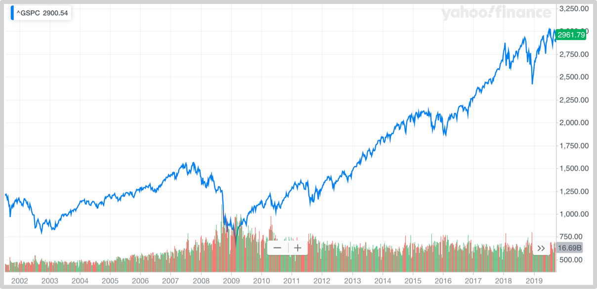
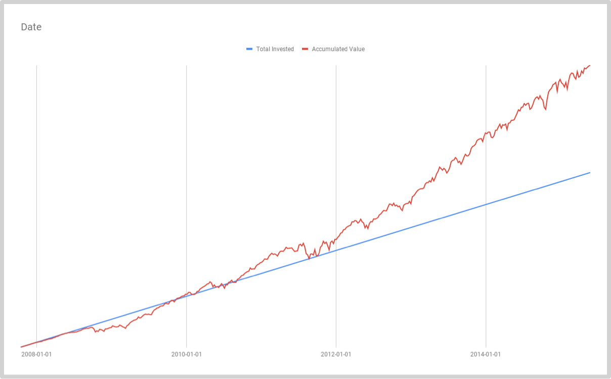
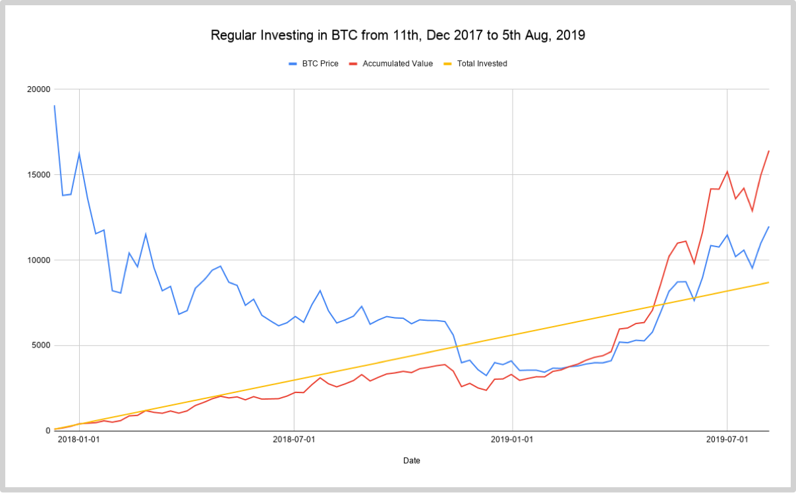
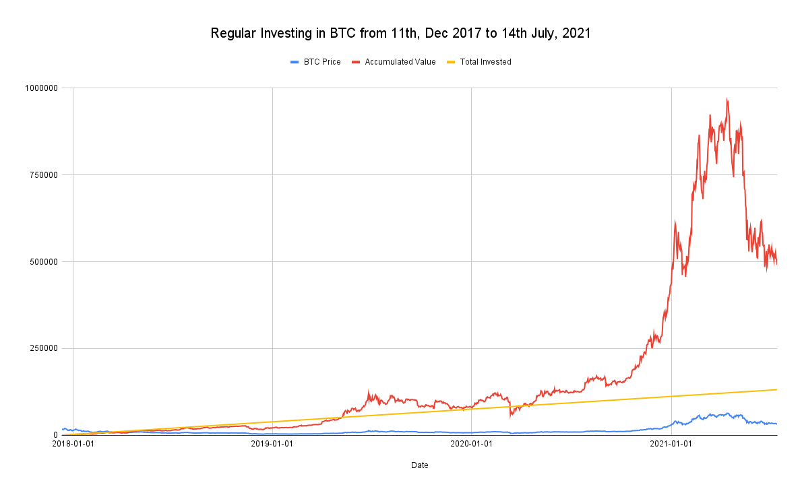

## 第一部分 定投策略

投资不容易，成功投资更不容易。然而，不容易并不意味着说没有简单直接粗暴有效的可行策略。定投策略，就是一个如此简单直接粗暴的有效策略，乃至于几乎人人都可以正确掌握进而正确践行。

### 1.1 定投策略极其效果展示

定投测了很简单：

> 针对某个投资标的在很长的时间内定期投资一定的金额。

例如，在未来的5到10年之中（很长时间，即长期），每周（定期）投资BOX这个无管理费的区块链数字资产ETF产品（投资标的）**150美元或者1000元人民币**（一定的金额）……当然，你可以把BOX替换为任何值得长期投资并持有的标的，比如苹果公司股票、贵州茅台股票，可口可乐股票，或者标准普尔指数基金（S&P500）.

如此简单的策略是否真的有效？用数据说话最靠谱。

假设你在2007年10月8日进入市场，开始定投标准普尔指数基金（S&P500）——当然，我们现在都知道，那可是最坏的“时机”——那天基本上是后面被称为“2008年全球金融危机”的起点，从那天开始，标准普尔指数“一路狂泻”。如果你竟然从那时开始每周定投标准普尔指数基金1000美元，并持续拥有……

结果如何呢？如果我们现在正站在2007年的10月8日，那么就很难清楚地想象结果究竟如何；可是，从十多年后的今天回头望过去，答案就很“明显”——结果当然非常好。虽然经历了一段从1,561美元暴跌的过程，最低至2009年3月2日的683美元（所谓的腰斩），但毕竟收复了暴跌前的价格，不仅如此，此后价格持续上涨，虽然中间有所起伏，现在（2019年10月）已经是2,960美元以上了……

然而，很可能有一个非常重要的细节你并没有意识到。下图是你的累计投资额和你手中的资产净值曲线：

在图二中，红线（你手中的资产净值）在相当长一段时间里持续落后于蓝线（你的累计投资额度）；然而，大约在2009年年底的时候，红线穿越蓝线，此后几乎就一直处于超越蓝线的状态，并且相对于蓝线的增长是越来越快……

> 注：以上历史数据来自于Yahoo Finance(^GSPC),上图使用Google Spreadsheet制作，你可以在这里在线浏览数据和图表。

重点在于，你是在最差的实际进入市场的，2007年10月8日。那时的标准普尔指数价格是1,561美元；而这个价格要到2013年3月25日才终于收复。

然而，你再看看图二，那根红线是在2009年年底的时候第一次穿过蓝线的！也就是说，虽然标准普尔指数价格从你开始投资的时候算起，总计耗费了286周才重新超过1,561美元；可是采取定投策略的你竟然在111周之后就开始稳定持续盈利了！当你的投资开始盈利的时候，标准普尔指数还需要30%的空间才能修复旧高，而最终，286周之后，等到标准普尔指数终于收复旧高的时候，你的盈利竟然早已是32.64%!

让我们再看另外一个更为震撼的例子。假设你从2017年12月开始定投比特币，那时的比特币创造了当前的历史最高价格，19,800美元左右，而后价格一路“狂跌”，至今尚未收复历史最高价格。一下图表是假设你从2017年12月11日连续定投比特币87周之后的情况。

> 注：以上历史数据来自Yahoo Finance(Bitcoin USD)，上图使用Google Spreadsheet制作，你可以在这里在线浏览数据和图表。

虽然你的入场时机是最差的——2017年12月11日你开始定投的时候，价格就处于当前历史最高点，比特币价格迄今为止（2019年10月）也尚未收复这个历史最高点。可是，你的投资竟然还是提前盈利的，因为从2019年5月6日开始，红线（你手中比特币的净值）穿越了橙线（你的累计投资金额）……假设你每周定投100美元，到了第87周，你已经累计投资了8,700美元，可是你手中的比特币净值竟然是16,417美元，累计盈利88.71%——虽然这个时候的比特币价格依然远未恢复，只不过是11,982美元，仅为历史最高价格的62.85%。

这就实在令人目瞪口呆了：

> 定投策略采用者即便是在最差的时机入场也总是可以**提前盈利**。

很多定投策略的拥趸，总是在宣扬一个仅为部分正确的事实，他们说采用定投策略可以“有效地降低均价”——可硬币的另外一面是，定投策略本身也可能“有效地抬高均价”，很明显，不是吗？也就是说，这些拥趸其实是使用了错误的依据幸运地选择了正确的策略，可是，一个底层就出错了的操作系统，能够持续运行多久呢？

定投策略之所以有效，核心机理在于**这个策略符合现实世界的真实状况：**

> **熊市就是比牛市长**，并且长很多很多……

例如，在过去的1,000天之中，区块链数字资产交易市场里，所谓的牛市连150天都不到……同样的模式随处可见，无论你观察哪一个价格曲线变化都会发现同样的模式，无论是标准普尔指数基金（S&P500）价格，还是可口可乐，苹果，谷歌，亚马逊，网飞，脸书，腾讯，阿里巴巴，抑或贵州茅台……熊市总是很长很长，牛市很短很短；牛市短到什么地步呢？人们甚至把那个时段的价格叫做泡沫——比如，上个世纪九十年代末的互联万泡沫。

理解了这个关键之后，你就明白了：

> 通过践行定投策略，你的未来利润本质上全部来自于你所经历的熊市！

绝大多数交易市场中的投资者并不了解这个本质，这也是他们之中的绝大多数注定投资失败的最本质原因——他们希望自己能在转瞬即逝的牛市里快速地赚到钱。一个令人沮丧的现象是，大多数在牛市里被吸引进市场的“投资者”注定会折戟而归，因为还没等他们反应过来，短暂的牛市已经结束了，漫长的熊市已经开始了……与他们截然相反的是，定投策略采用者恰恰是在熊市里慢慢积累能量的。

事实上，定投策略不仅仅适用于在交易市场里投资，它几乎适用于生活中任何一个重要的领域，无论是学习、工作还是家庭。所谓的终生学习或终生成长，本质上就是采用定投策略——你想想是不是如此？现实世界运转发展的本质都是类似的，如果能为一个人的学习与成长画一个“价格曲线”，你就会发现它和标准普尔指数的价格曲线差不多，虽然最终大幅上扬，但，在此之前很长很长的世界里，由总体涨幅并不大的各种形状的起起伏伏构成——反正是同样的模式。也就是说，很多的时候，学习的结果显得还不如不学习呢！“熊市”总是很长，不是吗？这就解释了为什么最终只有少数人能够真正做到终生学习或者终生成长——道理是一模一样的，因为人们总是想在牛市里入场，快速赚钱，而后离开。

有一次杰弗里·贝索斯问沃伦·巴菲特，为什么你的投资策略这么简单，但却很少有人采用，甚至只有你一个人真正使用呢？沃伦·巴菲特的回答简单却又令人震惊：

> ……因为没有人喜欢慢慢变富。

沃伦·巴菲特的投资策略之中最重要的一个关键就是“长期持有”，他的原话是，“我们最喜欢的长期是永远”。定投策略之所以有效，本质上来看，是因为它是“长期持有策略”的最有效改良。沃伦·巴菲特大多数情况下也并不是一次性购入，他同样也会多次分批买入，而后长期持有；同样定投策略采用者不过是**在相当长一段时间里持续分批买入的同时坚决不卖一直持有。**

> **两年后的数据补充**
>
> 两年之后（2021.07.14）重新绘制的数据图表如下（Figure 04的重新绘制）：
>
> 
>
> **这是定投1312天之后积累的数据，在最初的图表中出现的第一次『上扬』，在随后的半年多时间里紧跟着『阴跌』以及一个『断崖』……但，最终，出现了更大幅度的*上扬*——居然是一个『哪怕腰斩了之后也亦然攀升幅度很大的上扬』。最终的累计投入与最终资产价值相比，以及开始显得『微不足道』；而收益率之高，则不言自明。**

[**返回首页**](./index.md)
