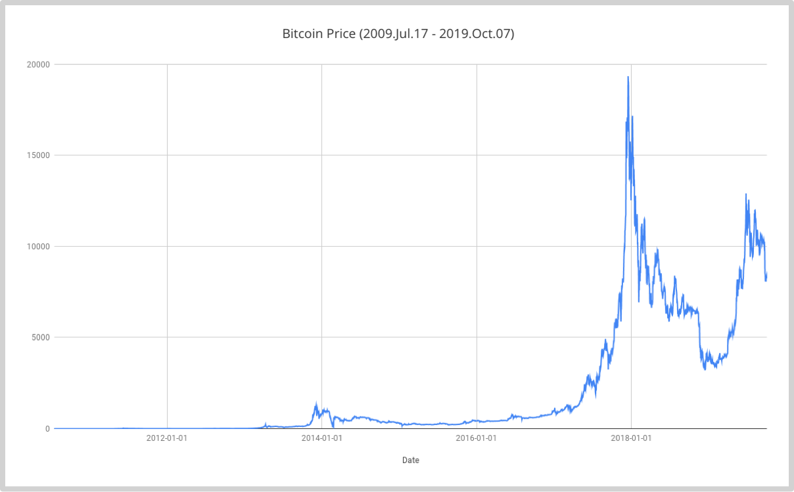
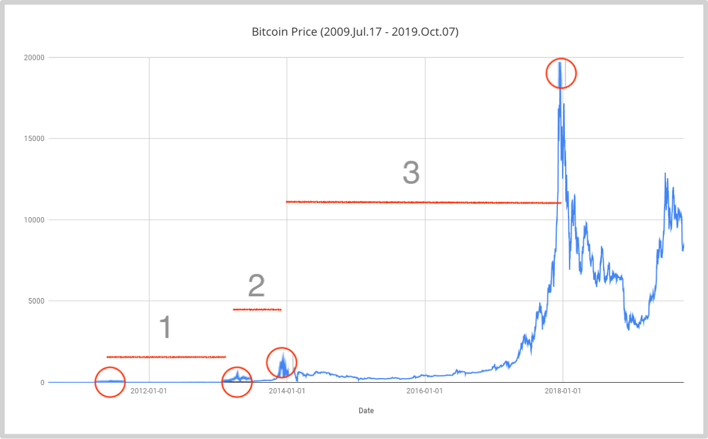

## 1.2所谓长期它究竟是多久

定投策略的核心本质之一是长期持有——持有期限越能保证盈利，这是公认的事实。可是，有个前提非常重要，若是不能清晰定义它，那么就根本无法继续任何深入的讨论：

> 长期究竟是多久？

在这个问题没有准确答案之前，“长期”这个必要的概念基本上是“没办法使用的”——任何概念，都必须清晰准确，否则就无法使用。又，由于概念必须与其他概念组合使用，大量含混的概念放在一起，就会造成精度上的巨大损失，这就好像80%的5次方会变成32%不到一样。在以下的阅读过程中，你会遇到若干个因为必须组合使用所以必须洽川准确才足够有效的概念。

与绝大多数人不一样的是，李笑来对长期这个概念有一个相对准确可用的定义：

> 所谓长期，指的是两个**大周期**以上。

“长期”这个概念的清晰准确定义又依赖于对另外一个概念的清晰准确定义——“大周期”。什么是大周期呢？让我们用比特币的历史价格趋势图作为例子说明大周期的定义和划分。

一个大周期由一个下降的**B阶段**和上涨的**A阶段**构成。在当期这张图表中，我们可以直观地看到的一个完整的大周期，是2013年12月份开始下跌的B阶段和后来逐步上涨至2017年12月份的A阶段。

如何判断一个大周期的起点呢？关于一个**大周期**的起点究竟是什么时候，我们只能做**滞后判断**——通常的情况下，我们只能在事实以及发生的很久之后才能确定地知道“当前历史最高点”究竟在哪里，因为价格总是高低起伏地波动着上涨，所以，短时间的“跌落”总是不一定能够证明价格会继续上涨。这个“滞后”的程度总是很长的，虽然说具体有多长难以确定，但，有一点是确定的，它的滞后程度肯定会使得你无法使用这个滞后判断做出对短期交易有帮助的决策。

在同样的图表中，我标注了我自己在区块链世界里经历的三个完整的大周期，其中第一个大周期是大约在2011年6月8日的32美元开始，到2013年的4月11日266美元结束；第二个大周期从这一时间点开始到2013年12月19日1,280美元左右结束；第三个大周期从这一时间点开始到2017年12月17日19,800美元左右结束……事实上，我经历的大周期大于三个，在2011年6月比特币价格达到当时历史最高点32美元之前的两个月我就入市了，在2017年12月比特币价格达到当前历史最高点19,800美元之后的今天（2019年10月）我依然持有并将继续持有比特币……

这张图有很多细节值得深入思考，比如，从这张图中你可以清晰地理解上一节中我们所说的“熊市就是很长，牛市就是很短；熊市就是比牛市长很多很多……”

为什么强调“两个”大周期以上呢？很多人无解了趋势，他们看到昨天价格比前天高，今天价格比昨天高，然后就以为看到了“上涨趋势”，误以为明天的价格就会比今天的更高……事实上，趋势这个东西，短期之内是根本无法判断的——甚至，在一个周期之内也是难以判断的：

> 只有经过了**两个大周期**之后，我们才可能**确切地**知道这到底更可能是个上涨趋势呢还是更可能是个下降趋势呢？

再进一步，请注意上文中使用了两次的“更可能”。即便是在两个大周期之后，我们依然没办法100%确切地根据历史数据认定趋势。站在当前的时间点（2019年10月），比特币尚未收复历史最高价格的情况下，我们其实并不能百分之百确认比特币的价格走势会再一次超越历史最高点，而后还能不断创造历史新高……到底是不是超这样,我们只能靠滞后判断——滞后很久的判断。最终，站在任何一个时间点上，能够作为我们投资依据的，是个无法百分之百精确的判断，因为未来充满了风险与未知，我们只能用“更可能”和“在多大程度上更可能”作为判断依据——事实上，这也恰恰是投资的有趣之处。

在上图之中，2011年6月那次的当时历史最高点几乎完全看不到了——可事实上，如果把每一次历史最高点前后的图表放大之后，你会看到惊人的相似：

它们都和当前的总体的历史价格走势图长得差不多……也就是说，即便我现在身处在第4个大周期之中，即便类似的“基于更可能”的判断已经做了3次，这一次依然无法完全确定，依然用且只能用“更可能”作为判断依据。只不过颇为庆幸的是前3次的基于“更可能”的判断已经被证明为真而已。

现在我们可以稍加总结整理了：

> - 一个阶段的上涨不叫趋势，一个阶段的下跌也不叫趋势——**短期之内根本无法判断趋势**；
> - 一个阶段的下跌（B阶段）加上一个阶段的上涨（A阶段）才构成一个完整的**大周期**；
> - 我们可以把每一次**历史最高点**当作一个大周期的B阶段的起点；
> - 每一次历史新高只能靠**滞后判断**认清；
> - 判断趋势需要**至少两个大周期**才有意义；
> - 关于趋势的结果通常是“**再创历史新高**”——至于究竟有多高依然只能靠滞后判断；
> - 所谓的长期持有，指的是**持有两个大周期以上**，让句话讲，“穿越至少两次牛熊”……

用如此“升级”过后的认知，把这些清晰准确地概念组合起来，再去看其他所有的价格走势就会得到与之前并不相同的思考结果。以下是标准普尔指数1956-2019的价格走势：

> 注：以上历史数据来自于<u>Yahoo Finance(^GSPC)</u>，上图使用Google Spreadsheet制作，你可以在[这里](https://docs.google.com/spreadsheets/d/1RsmiifuZajR_POx1zO_--qUcOgwb7tABNQpT-O69Ryk/edit?usp=sharing)在线浏览数据和图表。

对于经济周期的形成，有一个很容易理解的角度：

> **经济周期的形成，本质上是参与经济的多方协作时而协调、时而不协调造成的。**

当多方之间——这个多方，指的是很多很多方，多到还多节点完全没办法知道另外一些节点存在的地步——的沟通效率越来越高的时候，周期的时长就会随之变得越来越短，虽然波动也许永远不能消除——即，多方之间偶尔的不协调无法消除。

如果从这个角度看的话，我们就很容易理解为父母上个世纪三十年代的美国大萧条要那么长时间才能恢复（那就是一个大周期的完成），而上个世纪九十年代的亚洲金融危机修复却只用短短几年？进而，到了这个世纪，为什么美国次贷危机引发的全球经济衰退修复的时间更快？

理由很简单很直白，谁都能明白：

> 信息的高速流动是的全球化协作更为连贯更为容易，因此，虽然危机依然会不断产生，但修复速度正在变得越来越快。

理由很简单很直白，谁都能明白：

> 信息的高速流动是的全球化协作更为连贯更为容易，因此，虽然危机依然会不断产生，但修复速度正在变得越来越快。

这也是为什么区块链数字资产的波动周期相对更短的主要原因。过去的八年里，我总是能听到很多人用比特币的挖矿数量减半时间，即，四年，作为周期判断的依据。也许最早的时候，这还有一点点的道理，可当比特币市值已经不再是区块链数字资产总市值的全部之时，这种判断正在逐步失去意义。

我认为，区块链数字资产交易市场的波动周期，总体上比股市的周期更短，并且将来会越来越短的核心原因在于，区块链交易市场的多方协调效率显然更高。从一点上看就明白了：地球上有影响力的股市总计就那么几个，区块链交易市场呢？你去coinmarketcap看看就知道了，不是几个，而是好几千个，每年365天，每天24小时地不间断交易，你说市场协调效率是不是远远超出传统证券交易市场？

这是真正的好消息：

> **大周期正在变得越来越短……**

股票市场里的大周期从几十年早已缩短到十年之内，并且依然有着越来越短的趋势；而区块链数字交易市场里的大周期，不仅更短，并且同样在不断缩短……

股票市场里的大周期从几十年早已经缩短到十年之内，并且依然有着越来越短的趋势；而区块链数字资产交易市场里的大周期，不仅更短，并且同样在不断缩短……

在李笑来眼里，所谓的长期并不是虚无缥缈的“永远”，而是一个非常清晰准确可用的概念。在股票市场，未来的两个大周期大约是10 &#126;15年；在区块链数字交易市场，未来的两个大周期大约是6&#126;8年——无论是哪一个，都属于可期待的未来了罢？