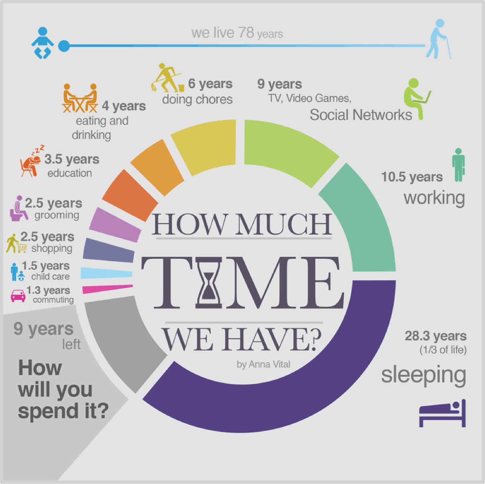

## 1.3为什么一定要用钱去赚钱

对大多数人来说，钱只有一个用处：消费——很遗憾，这也是为什么绝大多数人无法财务独立或者说财富自由的最根本原因，因为他们几乎从未认真思考过钱的第二个，远比第一个更为重要的用途：**投资。**

只会消费不懂投资的人，很难摆脱原有的命运，因为他们只能靠出售自己的时间赚钱。可是，一个人能出售的时间是极为有限的，比人们一贯以为的少很多很多。有一组数据可以帮助我们理解一个人可出售的时间究竟少到什么地步。如果按照我们每个人的平均寿命为78年计算的话，

> - 睡觉时间加起来大概是28.3年；
>
> - 工作时间只有10.5年——这是大多数人可出售全部时间；
>
> - 花在各种各样社交媒体上的时间有9年；
>
> - 花在做家务的时间有6年；
>
> - 花在吃喝上的时间有4年；
>
> - 花在真正接受教育的时间只有3.5年；
>
> - 花在梳妆打扮上的时间只有3年；
>
> - 花在购物上的时间有2.5年；
>
> - 花在照顾小孩的时间有1.5年；
>
> - 花在路上的时间有1.3年；
>
>   ……

如此计算下来，供你自由支配的时间只剩下了9年，仅仅9年！你能够用来出售的时间，即，你的所有工作时间，其实只有10.5年。什么叫做拼？如此看来，所谓的拼，无非就是10.5年全部用来售出之外，另外把可用来自由支配的时间也尽量甚至全部卖掉……可就算你把可供自由支配的那9年全部用来出售，加起来也只不过是19.5年，根本做不到“翻倍”。并且，比较一下你的工作时间和睡觉时间，一个是10.5年，另一个是28.3年，是不是觉得睡觉太贵了？

年轻的时候，我和其他年轻人一样，是非常拼的。刚才学校毕业出来做销售的时候，我曾经一周内六个晚上睡在火车上，早上下车找个洗澡的地方换衣服，然后做一天的培训工作，而后晚上踏上火车睡上一觉，醒来后就在另外一个城市里继续工作……

认识我多年的人都知道，李笑来是不过节假日的。这是为什么呢？因为在1995年大学快毕业的时候，有一天我突然想，怎么节假日这么多？一年365天里竟然有115个法定节假日！也就是说，一年的1/3被“休息”掉了！我就觉得有什么地方不对。后来注意到“法定”两个字，于是恍然大悟——哦，这个法定节假日是用来限制用工企业的，到了法定节假日，企业不让人休息，那企业就违法了……也就是说，这个法定节假日之中的“法定”限制的并不是个人——并没有任何法律可以说：“今天是法定节假日，你不休息，所以你违法了！”于是，我就决定，从此之后，法定节假日与李笑来无关！于是，从1995年开始到2019年，24年过去了——我就是没有周六周日、没有元旦春节，每天该干嘛干嘛地走过来的。我出版过很多书，几乎都是在别人过春节的时候我把自己关在家里打手整理出来的。你说，我是不是真的很拼？

大约十年前，我突然发现“在意自己的发型”的时间成本非常高。每个月都要花上一两个小时去理发，动不动还要在理发店等很久……于是，我决定以后自己理发。一把飞利浦电动理发器真的很便宜，300多块钱，能用好几年。于是你就看到了我随后十几年里的固定发型，3毫米圆头板寸。这很简单，基本上就是在某次淋浴之前，用推子在镜前自己三五分钟搞定。你看，在节省时间方面，我是不是真的很拼？

可是呢？数据是令人无比沮丧的。你看看我，24年没有节假日，我给自己拼出来多少可出售时间呢？就算我不把节假日当作休息日，每天平均下来，有效工作时间4小时就很了不起了——你真的为自己工作过，不磨洋工的话就能理解，一天努力下来，真正有效的工作时间其实是非常少的。那么，这24年我的有效工作时间是多少呢？

> 24×115×4=11,040

一万多个小时。那么这相当于多少年呢？

> 11,040÷（365×24）=1.26

你看，我对自己下手这么狠，那么结果如何呢？结果不过是相对于“其他真的很拼的人们”多拼了14%而已……我10年前决定自己理发，总计自己生了多少时间呢？每月1次，每次平均1.5小时，那么一年下来就是18个小时，10年下来，就是180个小时……你看，我用实际行动精打细算，真的够狠了吧？结果只不过是多了7.5天可供售出而已，用了这么大的力气，只不过是比所有人增加了2.28‰而已啊！

被认为是二十世纪最有影响力的经济学家之一的富兰克·奈特（Frank H Knight）有个著名的观点：

> “决定一个人富有的三个条件，一是出身，二是运气，三是努力；——而这三者之中，**努力是最微不足道的。**”

当然，这并不是说努力不重要了，因为相对成功可以靠努力，巨大成功只能靠运气——谁都知道运气是任何人都无法左右的；而出身（或者联姻）么——更不是绝大多数人可以仰仗的因素。你看，你能出售的时间，或称“有效时间”是那么有限——这也就深刻地解释了为什么努力最微不足道。

然而，用钱去赚钱就很不一样。**投资的本质就是用你的钱去帮你赚钱——而钱这个东西，它是不休息的，它一年365天，每天24小时，在投资正确的前提下，它都在为你工作……**请问，你的汗水和努力怎么跟它比拼？我们之所以很羡慕沃伦·巴菲特就是因为以下的事实：

> 沃伦·巴菲特1930年出生，11岁买了他人生第一支股票，到现在2019年，已经78年了！
>
> 78年！——别人平均寿命78岁，其中只有10.5年时间可供出售仅仅一次；可是沃伦·巴菲特呢？他的钱已经帮着他78年每年365天，每天24小时地拼着……

这其中的天壤之别不难想象罢？真的非常惊人！

[**返回首页**](./index.md)
