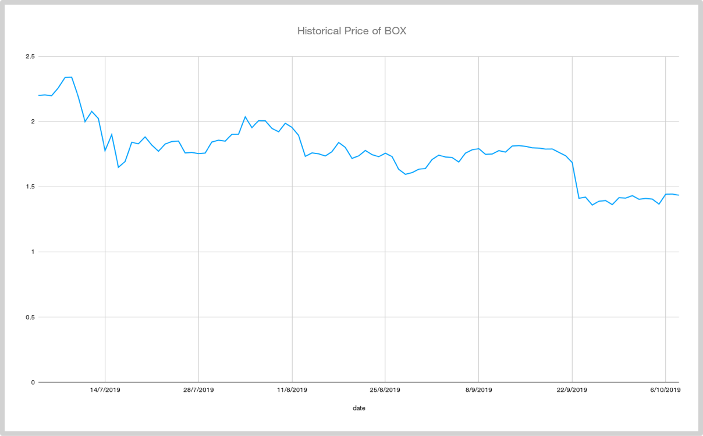
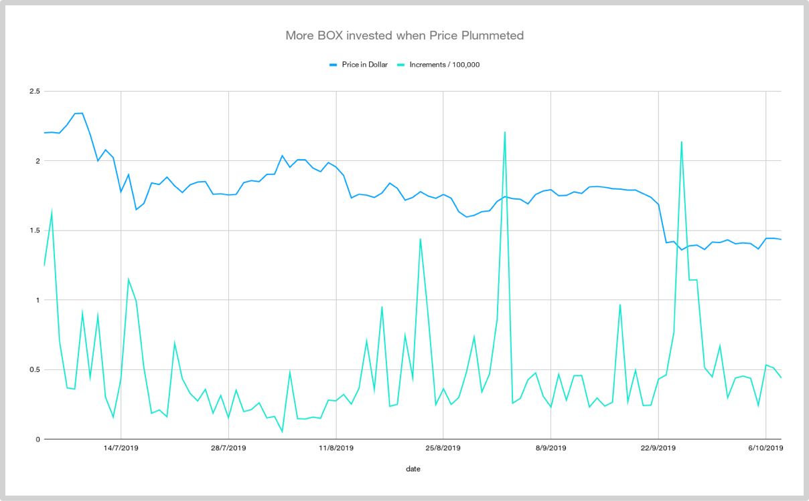

## 1.5 定投策略无需再次改良

对于定投策略，我们都要无穷无尽的改良欲望——谁不希望自己手里的工具更精良一些呢？有趣的是，

> 任何对定投策略的改良都是徒劳。

在Mixin Messenger上的BOX定投践行群从2019年7月底成立开始到2019年10月9日，群内已经有3261名成员。大家在认真了解定投策略的本质之后，明白了“定投者未来的利润几乎全部来自于漫长的熊市”，于是，因为思考的不同，所以对同样的世界竟然产生了截然相反的感受——每次价格下跌的时候，他们体会到的不是沮丧与恐惧，反倒是高兴甚至亢奋，因为“又可以那到更便宜的筹码了”……所以，他们的决策也与外界截然相反。

以下是过去一段时间里BOX的历史价格走势：

下图之中叠加了每日的BOX新增流通量——也就是在那一天人们总计又投资了多少BOX。为了能够让图示更为直观，图表中的每日新增流通量被除以100,000:

> 注1：上图使用Google Spreadsheet制作，你可以在这里在线浏览数据和图表。
>
> 注2:2019年9月2日那天的新增高达221,010BOX，但兵不应该算数，因为仅我一个人当天的购买量就有180,621BOX……我市老手，我当然不关注眼前价格和眼前涨跌。

可以看到的是，每一次价格“大幅度”下跌的时候，BOX的新增量都会有极大幅度的提高。最为夸张的一次发生在2019年9月25~27这3天，新增分别是214,048、114,240，和114,505——其中9月25日的新增量基本上市平时的5倍左右！并且，从这段时间的数据，你可以看出人们的反应是滞后的，因为那“价格暴跌”是两天前发生的，在9月22日夜里从1.68美元突然跌到1.41美元……事实上，每次价格下跌是购买量大增的时间段都有相当长一段时间的之后。

并且呢，虽然践行群里的成员们都听过课，我也在课上反复强调：

> 对定投策略的任何改良都是徒劳的。

但还是有相当一部分人依然忍不住被自己的一个天真想法所驱动——每次下跌的时候多买点岂不是更好？首先，每次根据当前价格作出的决策，事实上依赖的是滞后判断；更为重要的是，他们忽略了更重要的事实；每次决策之后的价格走势究竟是上升还是下降抑或持平，依然是随机的独立事件，不受之前的数据影响。

所以，在7月份里，因为遇到价格下跌就不由自主增加了投资量的人，到了9月份就会“发现”自己的改良是完全无效的，并且，事实上吃了亏——因为两个月前的“加大投入”事实上抬高了自己原本可以更低一点的成本。

对统计概率知识能否深刻把握，是最影响投资者政策正确性的——可惜，有太多的人对这样的基础知识重视程度实在不够，并且在自己反复因此吃亏的情况下，全然不知到无知的代价竟然如此惨烈。

对知识完整的人来说，看到这种现象会忍不住笑出声来：

> 有些并不真正了解统计概率常识的人竟然会想尽一切办法去证明周一到周日之间究竟哪一天价格最便宜？

有人动手制作数据表，甚至同时动用Python编程，得到了可以支持他的结论的依据：

> 从2010年7月17日到2013年1月2日，一共900天，统计了每一天开始定投350天后的收益情况；合计900个“350日定投”后，得到结论：
>
> > 如果选择周一定投，最终持有BTC数量，比周二到周日的平均值高1.2%……
>
> 另外，最好避开周日定投，或许是因为，周日大家都有时间买币，或者周日心态比较乐观，所以，周日平均可以买到的BTC数量，比平均少0.8%……

这种结论有意义吗？我们基本上不可能用逻辑说服那些不懂随机事件独立性的人。不过，沃伦·巴菲特在1984年的一篇文章中讲过一个特别好玩、特别生动，且有特别深刻的例子，可以拿来作为教育辅助工具：

> 想象一下从明天早上开始我们让2亿2千5百万美国人都在早上抛一次硬币，猜对的人就可以从猜错的人那里赢得一块钱。此后，每一天都有猜错的人出局，留下来的胜利者将继续游戏，但都必须把此前所赢来的钱全部用来下注。如此这般，10天之后，大约会有22万人竟然连续猜对了10次，而这些人每人差不多都赢了1000美元多一点点……
>
> 这时候，这一票人多少会有些飘飘然，他们也许会故作谦虚，同时也很可能会向异性炫耀自己的本领，甚至私下很乐于分享一些他们对抛硬币的超凡且有应该保密的见识。
>
> 让这个游戏继续，再过10天，我们仍会有大约215位优胜者，他们竟然连续猜中了20次！并且，在这整个过程中，赌注从最初的1美元翻倍到了1百万美元！
>
> 这时，这一票人已经被胜利冲昏了头脑，他们也许会开始出书，书名大抵应该是《我如何在20天之内用1美元赚到了100万美元》，并且开始做全国性巡回演讲，教导人们猜硬币的技巧。面对那些对他们的能力有所怀疑的学者们，他们会反驳说，“如果不是因为我们懂得技巧，怎么会有这么多个成功的实例？”——毕竟，215不是一个很小的数字！

“最好在周一投资而不是周日投资”的这种策略事实上很难奏效除了不符合统计概率常识之外，还有另外一个原因：

> 如果它真的有效，那么“所有人都会转而如此操作”；这样的结果时，这个曾经有效的策略只能失效了……

对定投策略的进一步改良注定无效的最重要原因在于，定投策略的核心依然是**长期持有**；只不过是分批买入而已，剩下的依然是谨慎选择，依然是买入后长期持有——这么做的结果，对我们这种长期有着清楚认知（两个大周期以上）的人更是显而易见：

> 在两个大周期之后回他再看，两个大周期之前的价格无论如何都是极低的，哪怕真的能在极低的价格上在降低千分之几，事实上的意义并不大——更何况事实上并不一定能够做到呢！

如果你仔细观察一下那些对“事实上无效的技巧”充满兴趣、充满好奇，并且总是忍不住去尝试各种“雕虫小技”的人，你就会发现，他们的出发点都是一样的，他们只能看到眼前，他们也恰恰因此不具备高瞻远瞩的能力。

切记：

> 一切与长期无关的细节都是鸡毛蒜皮。

请认真思考并揣摩以下依据名言的深刻含义，它是投资教父，沃伦·巴菲特的老师本杰明·格雷厄姆说的：

> 短期来看市场是**投票机**，长期来看它是**称重机**。

[**返回首页**](./index.md)
