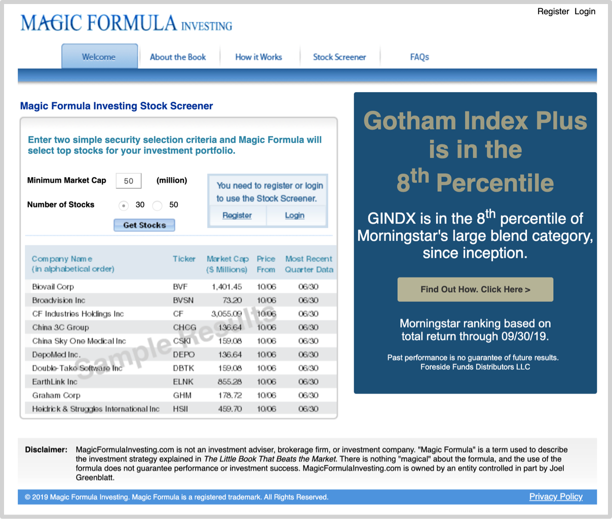

### 2.1可以盲从的投资建议

刚刚进入市场的人所面临的最棘手的问题都一样：

> 究竟应该选哪一个呢？

连选择依据究竟应该有哪些都不知道的人，怎么可能选对呢？你能看到表象无法看到本质的人有在吗可能选择正确并在此之后长期坚定持有且毫不动摇呢？然而，有个非常简单直接粗暴有效的策略：

> **盲从**那些已经长期展现**长期**成功业绩的真正成功投资者的建议。

“盲从”听起来是非常可怕的，可问题在于，我们确实可以盲从那些已经展现**长期**成功业绩的真正成功投资者的建议——请注意这里的限定词汇，“长期”。因为在投资领域，有一个非常神奇的现象：

> 越是拥有长期成功经验的投资者越是开诚布公。

沃伦·巴菲特很早就开始坚持每年给投资人写公开信，后来再电视崛起的时代也同样热衷于通过新的媒体手段毫不保留地汇报自己的投资行为、投资理念以及决策过程。自从1965年开始，巴菲特每年给投资人的公开信从未间断过，截止2018年，已经坚持了53年！从1973年开始，他和查理·芒格每年举办投资人大会，耐心回答投资人各种刁钻提问，到2019年，有就是在46年之后，参加伯克希尔·哈撒韦投资人大会的人数创造了16,200人的新高——这当然还不算全球无法统计的在线观众。

> 在以下链接可以查看1977-2018的历次伯克希尔·哈撒韦投资人公开信：
>
> > http://www.berkshirehathaway.com/letters/letters.html
>
> CNBC的网站上有一个专区，叫Warren Buffett Archive:
>
> > https://buffett.cnbc.com/warren-buffett-archive/

沃伦·巴菲特的老师本杰明·格雷厄姆也同样是乐于分享且毫无保留的人。他不仅在课堂上传授投资知识，还写了很多本书，其中传播最广的就是Security Analysis(中译《证券分析》，1934)和The Intelligent Inverstor(中译《聪明投资者》，1949)——而当年19岁的巴菲特正是因为*The Intelligent Inverstor*这本书才成为本杰明·格雷厄姆的粉丝。1951年的某个周六，他在哥伦比亚大学商学院的图书馆获知本杰明·格雷厄姆是政府雇员保险公司（GEICO）的主席，于是马上跑去访问公司……许多年后，沃伦·巴菲特接受福布斯杂志采访的时候说，20岁的时候我投资GEICO是回头看我自己最得意的投资之一。

乔尔·格林布莱特的投资业绩甚至比沃伦·巴菲特还要惊人——在1985年到2006年之间超过20年的时间里，他创造了竟然略超40%的年化符合回报率！这样一个真正做到长期持续成功的投资者还是同样乐于分享，并且开诚布公。他前后出版了三本书，分别是You Can Be a Stock Market Genius(中译《股市天才》，1999)，The Little Book That Still Beats the Market(中译《股市稳赚》，2010)以及The Big Secret for the Small Investor(2011)……你知道乔尔·格林布莱特写书接地气到什么地步吗？他写书的自我检验标准是“自己的十几岁的孩子能不能读懂？”——与中国古代诗人的“老妪能解”有得一拼。不仅如此，乔尔·格林布莱特觉得公开的还不够，于是干脆做了个网站：

https://www.magicformulainvesting.com——在这个网站上，用户甚至无须注册，只要按要求输入几个参数就可以获得一个基于他的“神奇公式”而定制的投资组合！你拿去用就是了……

大家现在已经相当熟悉的桥水基金创始人瑞·达里奥亦是如此。Principles(中译《原则》，2017)在正是出版之前，早在2011年就可是网上“开源”发布。到了2019年，瑞·达里奥甚至专门雇佣了一个团队制作了一个移动APP，Principles in Action,以便读者能够更为方便地践行书中的原则……

在投资领域，必须用金钱、时间和行动才能产生实际业绩，所以，这里的人要么是1要么是0——只有那些获得了长期成功业绩的投资者才是1，剩下的全是0，而那些在各种媒体上天天忙着喊话却只不过是纸上谈兵拿不出业绩的各种所谓专家，同样是0——他们发出的，事实上全部都是噪音而已。甚至，那些真正长期持续成功的投资者，因为他们自己的讲演和著作都已经表达得再清楚不过了，对他们的见解以及行为进行任何解读都没有太大的意义。

事实上，新手所能选择的最简单直接粗暴有效的策略就是沃伦·巴菲特买什么，他们就跟着买什么。根本无需妄想“超越沃伦·巴菲特”，只要花钱买他公司的股票，就相当于能够“跟上沃伦·巴菲特”了——这不已经是最好的结果了吗？跟投沃伦·巴菲特太容易了，直接买伯克希尔·哈撒韦公司的股票就行……如果新手觉得伯克希尔·哈撒韦公司的股票太贵——2019年10月份，伯克希尔·哈撒韦公司的股票市价约为每股31美元——那么可以去看看沃伦·巴菲特的持仓列表，在他持有的股票列表中选择自己想要的就好了！

> CNBC有个专门的页面展示伯克希尔·哈撒韦公司所持有的股票列表：
>
> > https://www.cnbc.com/berkshire-hzthaway-portfolio/

当然，若是你真的这么做了，那么，最终成功的前提是，沃伦·巴菲特持有多久，你也要持有多久——你看，相对于选择，是否真的能够做到长期持有才是绝大多数人真正面临的最大问题。

再或者，干脆去乔尔·格林布莱特的神奇公式网站，根据自己的情况输入几个参数，获得一个投资组合，然后照做就是了……不过，需要提醒的是，乔尔·格林布莱特的神奇公式并不适合定投策略者使用，因为乔尔·格林布莱特的做法是“每年选一批股票，第二年再换一批”——你看，定投策略并不是唯一有效的策略，只不过，定投策略对大多数人来说简单到了极致而已。

为什么这些已经展现了长期成功业绩的投资者的建议可以盲从呢？首先是因为他们就是他们所采用的投资策略的长期使用者，并且，事实证明他们的策略禁得起长期的检验。他们是最擅长基于长期视角思考的，否则他们也没办法长期践行他们当初所选择的策略。在他们眼里，一个策略的长期有效性，与策略本身的复杂程度全无关系，恰恰相反，只有简单的策略才可能真正长期践行；并且，一个策略的长期有效性，与使用者的聪明才智也没有任何因果关联——决定一个投资策略最终长期有效的核心前提是，这个策略是否在很长一段时间里被不折不扣地长期执行？

**事实上，成功并没有秘密，就算有，那也应该叫“公开的秘密”。**一切通往成功的路径都是公开的，这个过程中所需的一切技巧和智慧也都是公开的，只不过，耐心地走很久，老实地对待每一个知识与见解，并彻头彻尾的执行，就是很少有人能做到的事情，少到什么地步呢？万众之中罕见其一。

这些人是人群当中极为罕见的真正做到**知行合一**的人——事实上，针对历史上各个领域之中所有知行合一的人提出的建议，我买都可以直接接受，并且也值得认真执行；从一开始就理解，那很好，照做就是，若是刚开始无法理解怎么拌？盲从。

关键在于，来自最成功的投资人的最具价值的 投资建议竟然是免费的！你甚至不用担心这些建议因为被所有人采用而失效，因为，现实已经证明绝大多数人就是不会采用这些价值连城的建议。也许是因为绝大多数人有简单恐惧症，他们认为成功太难了，所以必须掌握非常复杂的秘密，否则不可能成功。还有一个重要因素，即，普遍的恐惧，在阻止大家盲从这些无价的建议：直接用自己的钱执行自己尚未搞懂的别人制定的策略，实在是太可怕了！

当然，还有另外一个更为正当的理由：

> 人们都喜欢通过自己的聪明才智与自己的努力获得回报……

买沃伦·巴菲特买过的股票，就算成功了也太没有成就感了！这应该是绝大多数人隐秘而又实际的想法罢？

[**返回首页**](./index.md)
