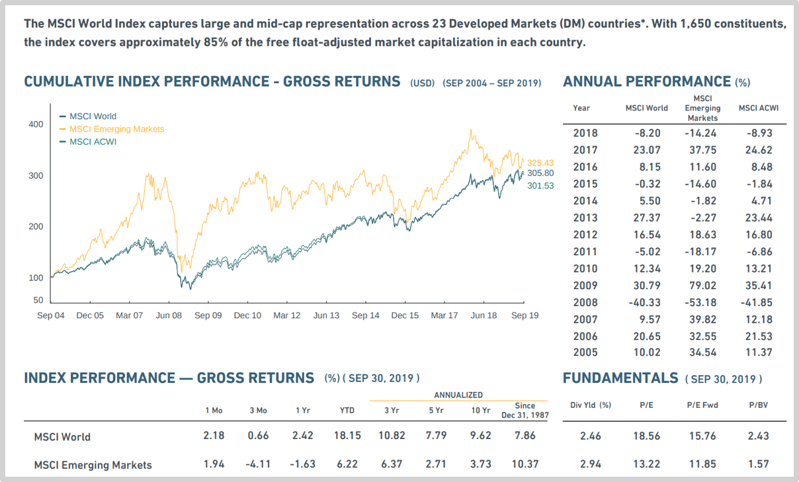
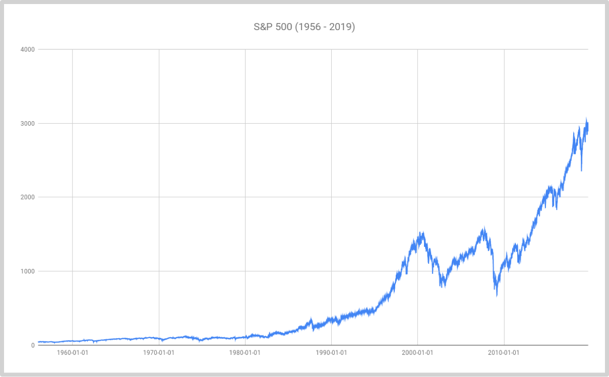
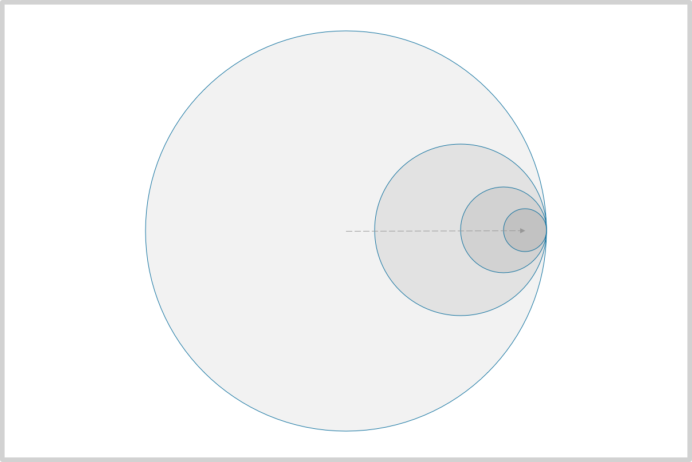

### 2.3长期视角与宏观观察

谁都能理解，在众多标的当中选择最棒的那一个事实上很难，尤其还有在价格动态变化之中进行选择——其难度和射箭冠军难在波浪中颠簸的小船上射中岸上远处的靶心别无二致。

只投资某一个标的还有另外一个隐蔽的风险，叫做机会风险。人们更为熟悉的是涵义基本相同但名字却不同的另外一个概念，“机会成本”。因为钱和时间都是排他性资源，你把他们投给了某个标的，那么就无法把它们同时投给另外一个标的……于是，如果你所投资的标的A比另外一个投资标的B成长少很多，那么你在持有A的过程中就一直面临着一个特定的最终可计算的机会风险。

幸运的是，我们有另外一个特别简单直接粗暴有效的解放方案：

> 投资**所有的**标的。

这听起来不仅有点疯狂，还有点傻……先别说傻不傻，果真能做到投资全部吗？答案竟然是肯定的，能！有一个指数，叫做摩根斯坦利资本国际世界指数（MSCI World Index）,追踪全球23个发达国际的总计1650支大市值股票的价格。如果我们竟然这么做了，最终的回报率究竟如何呢？

> 注：市场上有一些可投资的ETF是追踪MSCI World Index的，比如ishares MSCI World ETF(NYSEARCA:URTH),the iShares MSCI ACWI ETF(NASDAQ:ACWI),以及Vanguard Total World Stock ETF(NYSEARCA:VT).

摩根斯坦利资本国际除了世界指数之外，还有一些其他的指数，比如，MSCI新兴市场指数。据官方统计，从1987年12月31日开始计算，截止2019年9月30日，MSCI World的年化符合回报率是7.86%，MSCI Emerging Markets的年化符合回报率是10.37%——这也很自然，显然新兴市场成长更快一些，更高一些。

用一种形象的说法，投资MSCI World Index就相当于赌球运——押注全球经济的总体发展；而投资S&P500就相当于是押注美国的经济发展，是赌国运，即“美国的运气”或者“美国的命运”。再重新看看标准普尔指数的过往若干年的历史价格走势图罢，它也能提供大约为9%的年化复合回报！

> 注：以上历史数据来自于Yahoo Finance(^GSPC),上图使用Google Spreadsheet制作，你可以在[这里](https://docs.google.com/spreadsheets/d/1RsmiifuZajR_POx1zO_--qUcOgwb7tABNQpT-O69Ryk/edit?usp=sharing)在线浏览数据和图表。

投资S&P500(ACGR,Average Compound Growth Rate:9%)可能要比投资MSCI World(ACGR:7.86%)强，但是，投资MSCI Emerging Markets(GCGR:10.37%)好像比投资S&P500更好，最简单的解释是什么呢？

> - 美国发展相对于全球更快；
> - 新兴市场发展相对于美国竟然更快。

现在我们看到了，选择投资标的的时候，在“一个”（很危险）和“所有”（很平庸）之间，还有另外一个选项：“选择局部”，那么，哪一部分最值得选择呢？相对于“赌球运”这种类比，我更喜欢另外一个类比：

> 投资就好像是选择交通工具——不使用交通工具也不是不能到达目的地，就是多花很多很多时间罢了，只不过有些人很有可能致死也走不到目的地。有自行车的时候不应该选择步行；有机动车的时候不应该选择自行车，有飞机的时候不应该选择机动车……总之，选择那个最快的交通工具就对了。

我们已经看到新兴市场发展更快，所以，选择“新兴的局部”就好了，很简单，不是吗？进而，不选择“全球的局部”，即某个国家的整个市场，而是再进一步选择“局部的局部”，即，只选择那个国家的某些行业或者某个行业行不行呢？行！同样的道理，选择一个发展更快的或者最快的行业，就相当于选择了更快或者最快的交通工具。

在成千上万个标的中选择最好的那一个很难，在十来个地区选择一个发展最快的一两个地区，就很简单。谁都知道，地球上发展最快的两个地区是美国和中国。若是我去设计一个ETF，我一定会只在这两个“局部”寻找可投资标的，那么，这个ETF最终有很大概率能够跑赢MSCI World吧？再进一步，在这一两个地区中还可以做进一步的局部选择，在几十个行业中选择一两个发展最快的行业，相对来看，貌似依然不难……至少传奇投资人孙正义觉得很简单，他说，

> 赚大钱很简单，只要在二十年前你投资了互联网就可以了——因为站在那个时间点，互联网就是世界的未来。所以，现在要投资人工智能，因为人工智能就是未来。

事实上，我已经设计了一个〇管理费、〇开润的ETF开放基金，暂定名程为“奥德赛”（ODYSSEY），计划与2020年10月左右在美国公开发行。它由30个左右标的构成；全部来自两个地区，美国和中国的上市公司；主要的筛选标准最重要的只有一个：

> “谁的手里有不断增长的用户数据？”

我个人非常认同孙正义的见解，在未来的相当长一段时间里，人工智能就很可能是发展最快的行业。只不过，我也有一些稍微不一样的看法，比如，我认定另外一件事情：

> 算法再好，也需要数据喂养。现在手中掌握大量持续增长的用户数据的上市公司，都已经有足够的盈利能力。如果将来算法是大树的话，那么他们手中正在不断增长的数据教务处最肥沃的土壤。没有土壤的话，大树是张不出来的。绝大多数算法公司到最后都会为拥有数据的大公司所用……

2011年我开始大量购买比特币的时候，很多人认为李笑来疯了，他们的评价通常是一样的，这东西风险太大了吧？“风险太大了”是他们的感受，我的感受截然相反：

> 不投资比特币的风险太大了吧？

让我有如此感受的众多逻辑推理中有这样一方面：

> 历史上我们已经看到并且经历了互联网使得信息以几近于零成本的方式快速流动给这世界带来的惊人变化；那么，现在若是资产可以像信息一样以几近于零成本的方式快速流动在未来会给这个世界带来在于惊人的变化呢？
>
> 正如我们在十年之后看到的，互联网带来的巨大变化已然发生——虽然并不是以我们当初所想象的方式，但那变化就是如此惊人；那么，十年后，金融互联网极可能同样给这个世界带来惊人的变化，虽然我们事实上没办法提前知道那巨大的变化究竟是以什么样的方式发生的……

所以，在那时的李笑来眼里，区块链是未来，区块链是趋势，区块链也很可能是发展最快的行业——8年后的今天再回头看，它的确成了发展最快的行业，而我的投资就那样一路搭着车走到今天这个之前无法想象的距离之外。

你看，“选择发展最快的行业”——这方法最简单直接粗暴有效。这也是基于宏观观察能够最直接得出的结论。在那些无法基于长期思考的人眼里，这样的一句话不仅根本无法被理解为有效建议，甚至在他们眼里这干脆就是一句废话，你可以想象他们会忍不住拂袖而起的冲动，口中大喊，“这谁不知道啊？！”是呢，大家都知道，但大家都不是基于长期思考的人，所以都不习惯于宏观观察，当然也就无法领会基于长期的宏观观察有怎样神奇的力量。

那能不能再进一步，去探寻“我能不能在这个我觉得发展会最快的行业里再进一步选择一个发展最快的企业呢”？我觉得还是算了吧，因为那样的话，你就相当于直接退回到了最初那个最危险的状态——这就是所谓的物极必反。宏观观察的核心技巧之一非常简单，就是“不要走到极限”，理由只不过是我们不仅讨厌风险，我们更讨厌系统性风险。正确的方法永远是“局部的局部”：

> - 在全球范围内寻找某个或某几个局部地区；
> - 在某个或某几个地区选择某个或者某几个行业；
> - 在某个行业里寻找某些个优秀企业……

但，无论如何都不应该“只选择某一个”——不管是地区、行业，还是企业，抑或项目。所以，即便是在“只能全球化”的行业里——区块链行业就是这样的——只要时机成熟，李笑来的选择就不再是某个单一标的，而是一个组合，BOX——里面的成份分别是BTC、EOS和XIN,总计3个标的。

看看示意图，也许更容易理解一些。

最外面的大圆圈代表整个世界，而你站在中央，手里拿着弓箭……

> 你环顾四周，想要找一个最值得举箭射中的点——这很难办，因为整个一圈看下来，其实有无数的点可以选择，而你要在这无数个点中选出最正确的那个，并且还要在那么远的距离之外一次射中，完全无法做到……
>
> 于是，你想了想，选择了全部——也就是说，你不用弓箭了，你换个工具，改用一张网……这样倒挺好，简单、容易，虽然效果一般，总是比你用弓箭射了半天一次都没有射中更好……
>
> 但你希望效果更好一些，于是，你先选择了一个大致的方向——事实上，你也不是乱来，你也的确有合理的选择依据：未来哪个地区发展最快，就往那个方向射箭么！这样做终归射中的概率更高一些罢？了不起，不用箭，往那个方向撒网么！
>
> 而后你发现还可以用几乎同样的根据再调整一下大概的方向。既然未来有些地区比另外一些地区发展更快，那么同样的道理，在那些发展更快的地区里，未来也会有一些行业比另外一些行业发展更快——同样的逻辑依然成立。
>
> 你已经做了三次猜测了，1）广撒网可能更划算一些；2）局部地区未来可能发展更快；3）在那些未来坑发展更快的局部地区里，某些行业未来发展可能更快……再继续“猜”下去，精度肯定受损的太厉害了……那怎么办？不用弓箭了，换个散弹枪罢！这样的话，虽然瞄的不够精准，但终归射中的概率会更高，甚至很高罢？再说，别说我瞄不准，既然那么远，所以事实上所有的人都瞄不准；既然所有人都瞄不准，那么，如此这般经过多次的调整，我的胜算应该更高罢？
>
> 到最后，你还有另外一个发现，那就是：无论在什么情况下，用箭都是最不划算的……

由多个而非只有一个标的构成的投资组合有神器的效果。最著名的例子还是来自沃伦·巴菲特。2017年4月，美国联合航空公司爆出丑闻，因为超卖航班座位，竟然用暴力手段将69岁亚裔乘客陶大卫强行拖下飞机，全球哗然。随即出现的大量报道当中有相当一部分是关于沃伦·巴菲特的，因为它手中持有很多美国联合航空公司的母公司联合大陆控股公司的股票。这些报道说，事件曝光当日，该公司的股价一度暴跌4%，市值损失10亿美元以上，连累沃伦·巴菲特一度损失超过9000万美元，当日收盘，该股跌幅超过1%，如此推算，他的当日账面浮亏差不多2400万美元。

然而，沃伦·巴菲特真的被连累了吗？并没有——因为他持有的不仅仅是这一家航空公司的股票。除了联合大陆控股公司之外，他还持有更多比例的美国航空公司的股票，也有达美航空公司和西南航空公司的股票……就在同一天，美国航空公司的股票上涨差不多4%，给巴菲特贡献了7300万美元的账面收益；达美航空上涨1%，贡献了1900万美元；西南航空上涨1.6%，优势3600万美元……总体算下来，沃伦·巴菲特当日账面盈利竟然约为1.04亿美元！你可以想象一下，如果沃伦·巴菲特的策略竟然是在航空板块中只选择某一个标的的话，那就肯定是另外的结果了。

