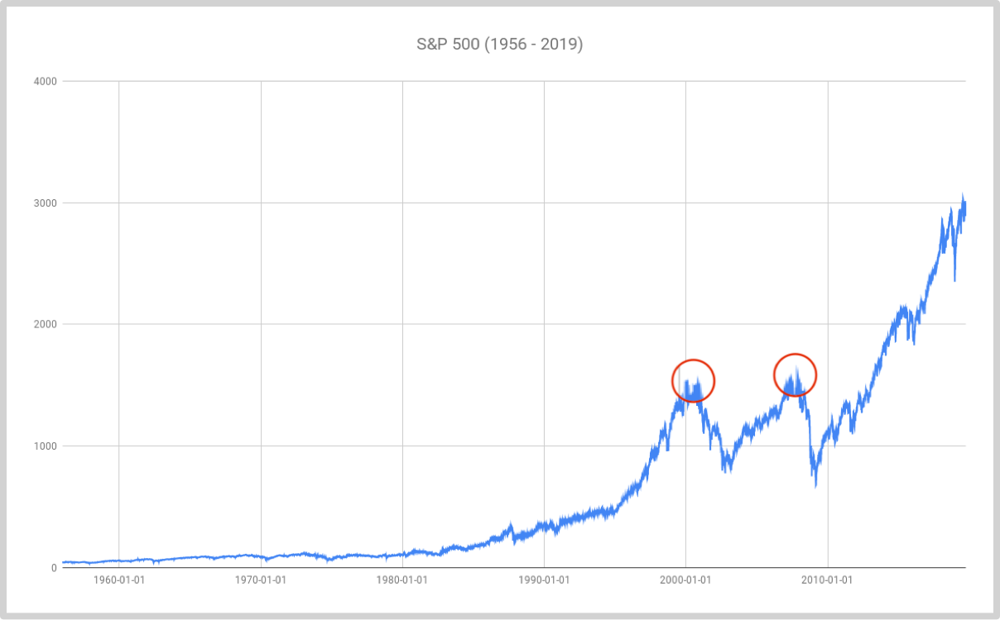
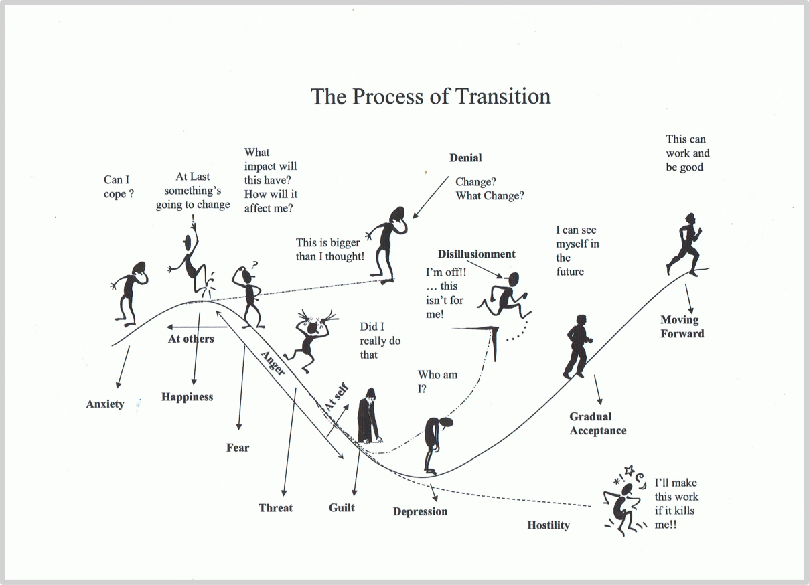

### 2.4 大势所趋都会有泡沫

曾经与“泡沫”这个词最常搭配的有“郁金香”和“互联网”，2019年的时候，多了另外一个搭配，“人工智能”（Artifical Intelligence）.人们开始担心全球人工智能（Artificial Intelligence）创业公司是否处于“泡沫破裂”的状态。哪怕仅仅一年前，这个行业里的创业公司还极为火爆——根据[**福布斯2018年10月5日的一篇报道**](https://www.forbes.com/sites/ninaxiang/2018/10/05/chinas-ai-industry-has-given-birth-to-14-unicorns-is-it-a-bubble-waiting-to-pop/#7a4d9c5f46c3)，仅在中国地区，就有至少14家人工智能创业公司已然成为独角兽，是指那些估值超过10亿美金以上且尚未上市的创业公司。这些公司加起来大约值405亿美元。再往前一年，人工智能创业公司更是炙手可热，清华大学的一份报告称，中国地区的人工智能创业公司在369次交易中累计获得了高达277亿美元的投资。

可为什么突然之间人们开始担心人工智能泡沫了呢？因为这个行业近期出现了大量的丑闻，在驯练算法的过程中违规使用用户数据，比如Facebook因为训练语音识别相关的人工智能算法被爆侵犯用户隐私，再比如IBM因为训练人脸识别相关的人工智能算法而同样被爆侵权……人工智能甚至被用来做恶，比如Cambridge Analytica操纵选举结果，比如Amazon使用算法自动开除不符合条件的工人……

最搞笑的传闻来自之前很火的Kiwi Campus。这是一家2017年与伯克利大学成立的人工智能明星创业公司，其产品是一个名为Kiwibot的送餐机器人，并以获得多伦融资。2018年11月，该公司CEO Chacez还获得了MIT颁发的杰出企业家奖……结果2019年夏天，有人爆料说，Kiwibot根本没用什么人工智能，这些机器是创始人在他的家乡哥伦比亚用每小时2美元的工资雇佣的大量廉价工人远程操控的。

人工智能行业看起来太火爆，创业企业融资总额太高，估值方法太含混，落地应用频繁出问题，这些都使人们不由自主地想起不久前经历过的互联网泡沫，于是，人们只好开始担心人工智能是不是也同样要泡沫破裂了……

可是，泡沫破裂了又如何呢？

让我们重新看看标准普尔指数的过往若干年的历史价格走势图，只不过，这一次多了两个标记，一个是2000年的互联网泡沫，另外一个是2008年的全球金融危机。如若我们身处在2000年到2003年之间的话，那个时候我们正身处寒冬，大量的互联网公司破产、解散……可我们现在已经身处2019年年底，现在回头看的话，从2000年到2019年，是互联网真正从“一小部分人的世界”发展到“所有人的世界”的过程。根据世界银行的统计，2000年中国网民数量只占中国总人口数量的1.8%；到了2019年一季度，仅**微信用户数量就高达11亿**……这就是互联网在中国的情况，从1.8%到70%用了解决20年的时间——大势么，总是需要很长时间才能全然展现。

对于定投策略采用者来说，即使他们在2000年“喝着泡沫”入场，到了两个大周期之后，也就是2015年再回头看，两个大周期之前的价格无论如何都最终“变成”了“低价”——原来，**低买高卖**的秘诀不过如此：

> 买入**很久很久**之后再卖出。

所以，人工智能泡沫破裂是好事呢，还是坏事呢？不知道对其他人是好是坏，但，对定投策略采用者来说，泡沫破裂总是好事儿，弄不好，**泡沫破裂的时候，很可能恰恰是定投者入场的最好时机**。

回顾历史，在任何一个领域都一样，一切最终的大势所趋在早期的时候都会经历至少一次的泡沫产生、泡沫放大，直至泡沫破裂的过程。郁金香泡沫和互联网泡沫不一样的地方在于，郁金香虽然不是完全没价值，但它不可能有可持续增长的价值；而互联网的价值是可持续增长的，互联网在经历早期泡沫破裂之后的二十年里，一直在持续增长，一直在创造价值，一直在改变世界。

为什么大势所趋在早期的时候必然经历泡沫呢？最佳的解释来自于约翰·费舍的**变革曲线***（Transition Curve ）:

人们在接受变化的时候，在最早期的焦虑过后，很快就会进入一个比较亢奋的状态，因为他们觉得“这一次终于能改变点什么了！”……然而，紧随其后的是很长的充满负面情绪的过程。在这里，人们会分化，有的人突然变得心比天高，随后遭遇更大的挫折；有些人会持续更久的彷徨之后产生幻觉，进而去做很多不现实的事情；还有的人不仅害怕，还会产生负罪感，甚至出现抑郁症状，最终干脆放弃……而另外一部分人会逐步接受，直至完全适应——可这已经是很长很长时间之后了。

多年之后展现出来的大势所趋，在最初的时候，就是需要大众经历以上接受过程的。上图中的第一个波峰就是泡沫产生的最根本原因，随后的博古就是泡沫破裂的理由。这一点在交易市场上展示得最为清楚，因为市场上每时每刻的价格，本质上来看就是在那个时刻市场上所有人对这个标的价值整体认知的体现——绝大多数人因为无知无畏而极为兴奋的时候，价格就会产生泡沫；绝大多数人因为事与愿违而极度沮丧的时候，泡沫就会破裂。

所以，与很多人以为的恰恰相反，**事实上，哪里有泡沫，哪里就可能有机会**——至于是否真的有机会，要看那个产生泡沫的事物有没有长期可持续的价值与增长。如果没有，那就是单纯的泡沫；如果有，那么，那就是机会——并且，后面可能还会有若干次泡沫，直至价值终于全然展现。

2017年12月，比特币价格在创造历史新高19,800美元之后，遭遇了漫长的熊市，迄今为止（2019年10月）依然处于熊市之中，价格仅为当前历史最高点的43%不到……可是，这一次的“泡沫破裂”和之前的许多次“泡沫破裂”有什么不同呢？从世界上第一个区块链应用比特币诞生至2019年10月11日，**比特币总计被宣告死亡337次。**每一次短暂的牛市，都被称为泡沫，当然都随即破裂……可是，2017年这次比特币价格泡沫破裂与之前的那么多次都不一样的地方在于：

> **再也没有人否认区块链的价值了。**

这是非常关键的微妙区别。我在判断一个趋势是否“已然成立”有个非常简单直接粗暴有效的分辨方式：

> **不是看大多数人是否都已经接受，而是看是否大多数人都无法否认。**

“**皆难否**”是一个趋势已然确立的重要标志。理解不理解并不重要，接受不接受也不重要，重要的是，全部都无法否认，那么这个趋势已然“基本上挤干了泡沫”——这是定投者最佳入场时机的最佳判断依据。虽然我关于区块链数字资产的ETF产品设计与思考最早始于2015年，然而，直到2019年7月，我才推出自己设计的〇管理费〇开润的区块链数字资产ETF产品，BOX——也是基于这种判断做出的时机选择。

需要提醒的是，绝大多数新手会掉进“寻找下一个……”的陷阱。事实上，虽然通过谨慎选择而后长期持有而后获得成功的人少之又少——不管是不是像定投策略采用者那样定期分批投入；与此同时，绝大多数人也从未认真地从长期视角出发进行深入的宏观观察，但是，所有人都羡慕那些极少数已经成功的人……于是他们不由自主地想到：

> 我要是那么早就选对就好了……

而这个想法会再进一步不由自主地转换成另外一个想法：

> 我也要找到一个投资标的而后早期进入然后同样获得成功！

这个想法真的非常危险！尤其是对那些新手来说更是极度危险。可微妙的是，越是新手这个想法越是强烈。你只要问问你自己就知道了，你自己有没有过这个想法？在深入问一问自己，是不是一入场你就不由自主地有了这个想法？这个想法是否总是让你不由自主地很焦虑？

这些即将掉入陷阱的人所不知道的是很多很多的细节：日不，真正能够改变世界的“大势”实际上少之又少，正所谓凤毛麟角；再比如，若是真有下一个大势真正浮现，那也应该是很多年以后而不是现在或者最近；更为关键的是：对一个已经被确认的大势来说，它自身的发展以及它的影响发挥，会持续很久很久；不仅很久很久，并且越往后越猛烈，事实上，这一个比下一个更为现实。

其实啊，一生若是能够抓住一个大势，那已经是天大的幸运。