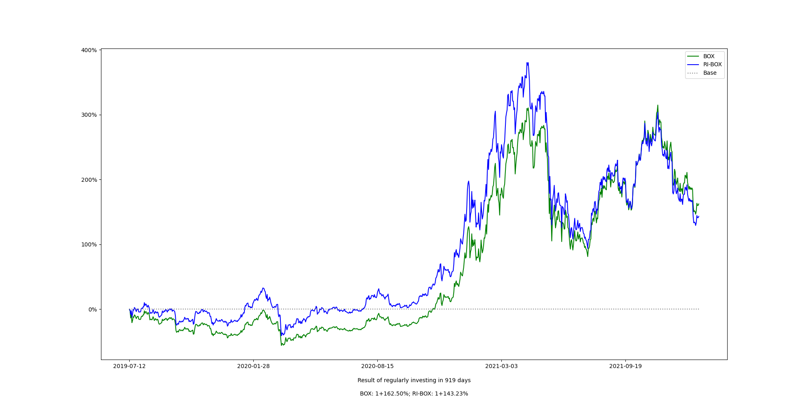

### 2.5在趋势之中符合趋势

选择最重要，在投资领域当中尤为如此。回顾一下之前的内容，我们已然经历了很多次选择：

> - 一个还是全部（全球）
> - 最佳的局部（区域）
> - 最佳局部之中的最佳局部（行业）
> - 最佳局部之中的最佳局部之中再选择若干个标的构成组合……

然而，概括起来却很简单，这些全都是关于**趋势**的选择。不选择“只投资某一个标的”，而是退而求其次“选择所有”——这是为了在避险的同时**跟上整个世界的趋势**，此时α为零；从全部之中“选择最佳的局部”，这是以退为进，意图找到发展最快的局部，进而有可能创造正的α；再一次“选择局部的局部”，这也是为了通过趋势的支撑获得更高的α——最终，在局部的局部之中做个组合，本质上依然是一样的做法：首先要降低风险，而后在看能否创造更多的α？

为自己的投资组合选择标的，最简单直接粗暴有效的原则是：

> 符合行业发展的趋势

以下将以BOX为例，因为它就是经过这样的选择过程而产生的投资组合。

> **风险警告**
>
> 定投策略本身是客观正确的，而定投标的的选择无论如何都没有办法剔除主观判断——所以，定投标的选择是投资者自己的事情，是要用自己今后长期的钱和时间去负责的事情。请务必慎重。
>
> 这一节的内容重点在于李笑来为什么要选择BTC、EOS、XIN，即，BOX，作为一个定投的组合——这里必然掺杂着李笑来的一些主观判断；至于你选择怎样的投资组合，要靠你自己对客观世界的客观理解。
>
> **作者利益关联公示**
>
> - 李笑来是比特币的长期持有这（自2011年5月）
> - 李笑来是EOS发行公司Blockone的天使投资人（2017年5月,已于2018年退出股东身份）
> - 李笑来是Mixin Network项目的天使投资人（2017年10月）

经过过去8年多的观察、思考与实践，我认为区块链技术在改变世界的过程中有一个已经慢慢展现出来的发展路线：

> 可信账簿（BTC）→可信代码平台（ETH/EOS）→可信执行环境（Mixin）→可信硬件（？）……

比特币是世界上第一个区块链技术的应用，它的核心是一个公开透明的、不可篡改、分布式可信账簿。而后来发展起来的以太坊和EOS的目标都是成为一个区块链应用平台，也就是说，程序代码要被写入并运行在公开透明的、不可篡改的分布式区块链平台上。把账簿放在区块链上，就有了可信账簿；把程序代码放在区块链上，就有了可信代码。Mixin Network通过结合TEE（可信执行环境）和DAG（有向无环图）创建了新型的公开透明、不可篡改的分布式数字资产储值网络，也就有了可信执行环境。也许在不久的将来，我们还会看到可信硬件？

之所以没有选择以太坊是出于技术原因，它目前所采用的的共识机制是POW——这种以分钟为单位确认一次的共识机制，根本不可能成为可用的应用程序平台。事实上，以太坊过去三年左右的实际运行历史早已证明了这个缺陷在POW机制下根本无法被解决。尽管以太坊计划未来会转移到dPOS共识机制上，但那就意味着必然产生一次分叉——2017年以太坊已经因为之前考虑不周而被迫分叉出一个今天不知道可以用来干什么的ETC——也就是说，以太坊投资者所要面对的风险不可想象。

> 诞生→先被企业采用（2B）→再被个体采用（2C）

EOS从这个角度望过去，就是个面向区块链企业的平台。而Mixin Network的第一个dApp，Mixin Messager,就是个面向个体的平台——除了即使聊天之外，他的重要组成部分之一就是目前行业里对新用户最为友好最为方便的分布式多币种钱包（这是底层Mixin Network共联的功能）。

另外，在我看来，这三个标的都到了“皆难否”的阶段，它们当然还没有被所有人接受；然而，所有的人都没办法否认他们的价值……这样的时候，定投策略采用者应该可以入场了。

到了2021年1月份，BOX定投践行群成立超过500天之后，BOX 的成分做了首次的调整，现在BOX 的成分总计有7个：

> ○BTC
>
> ○EOS
>
> ○ETH
>
> ○DOT
>
> ○MOB
>
> ○UNI
>
> ○XIN

——至此，BOX已经进化为一个相对成熟的「数字资产指数型的ETF」。以下图示，是从2019年7月12日开始算起，定投BOX收益的变化：

> 注：[点击这个链接查看具体数据](https://github.com/xiaolai/regular-investing-in-box/tree/master/data)

在投资领域中，对于α(跑赢市场的那部分盈利)究竟是否存在一直争议不小——即便是沃伦·巴菲特，乔尔·格林布莱特，瑞·达里奥这种依然拥有长期经验业绩的人（尽管是凤毛麟角）存在的情况下。有一个教学段子可以用来说明那些“市场有效性 假说”盲从者有多可笑：

> **一位学生看见地上有张一百美元的纸钞，就问身边的教授，“您看，那是不是一张一百美元钞票？”教授都懒得看，说，“那不可能！因为如果那真的是一百美元钞票的话，早就被人捡走了……”**

如果市场是百分之百有效的，那么α理论上是不可能存在的。可问题在于，如果我们把任何一个时刻的市场单独拿出来的话，它百分之百是无效的。价格和价值偶尔对等根本就不能说明任何问题，因为哪怕一只烂钟也无论如何都能在一整天的时间里不多不少对上两次！把每时每刻全都拼接起来，长期来看，市场理论上应该是有效的——可问题是，这个长期究竟是多长呢？没有人知道。另外，如果按照定投策略采用者的观念来看，两个大周期之后，以当前价格作为比较基础的话，每时每刻的市场价格偏差就显得更大了，不是吗？

我个人当然相信α的存在，并且总是在想办法找到更好的策略去创造它。你做得好，α就是正数；你做的差，α甚至有可能是负数。作为定投策略采用者，你最终的成绩可以用以下公式描述：

> p=δ+α-γ

p，就是你的最终成绩（performance）。δ（第4个希腊字母，delta,大写为Δ）用来代表的是市场整体的成绩。而γ（第3个希腊字母，gamma,大写为Γ），是借用晨星（Morning Star,2013）的一个同名概念——只不过，我的定义方法与晨星不同——γ在这里指的是因为你自己犯错而没有赚到的那些原本你应有的收益——这是个极为关键极为有趣的概念，将是本书第三部分的核心之一。

> **β（第2个字母，beta,大写为Β），指的是你的成绩与市场整体成绩的相关性，β为0的时候，就是“全然不相关”——比如，你“定投人民币”（就是不断地把你的人民币存进银行），那么你的成绩将与市场整体成绩全无关系。当β为1的时候，你的成绩和市场整体成绩100%相符……在p=δ+α-γ这个公式中，δ就是等于1的情况。**

对于定投策略采用者来说，一切的α都来自于开始行动之前的谨慎选择过程。定投策略采用者之所以幸福，最关键的地方就在于他们一旦开始就再也不用纠结选择了，当然也无需纠结是否调整、如何调整之类的恼人问题。

定投标的的选择，如你已经所见，本身并不需要太多的技巧，也不需要太多的聪明，甚至，他竟然是个“只需要大概大概就已经很不错了”的过程。然而，它真正的困难之处在于，作为定投策略采用者，你必须也只能在开始行动之前已经确认选择并且从此长期不变……也许这就是我能想到的“简单并不容易”这句话的最好的例子了。