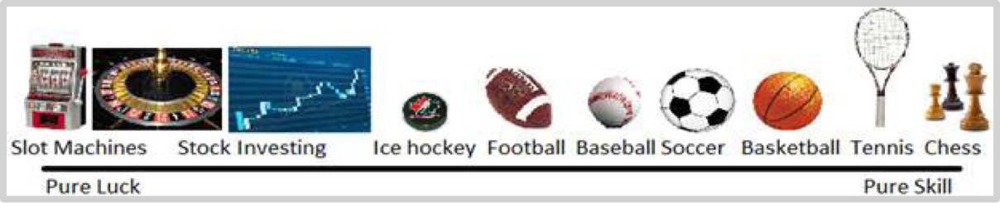
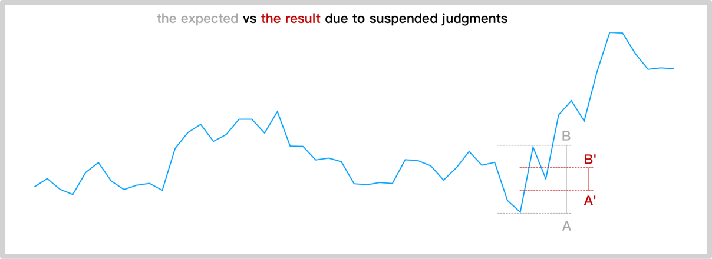

### 3.1屡战屡败不战而胜

著名策略分析师迈克尔·莫布森在他的书《实力、运气与成功》之中曾给出一个图示：

最右侧，例如国际象棋，是百分之百靠技巧的，没有任何运气因素；最左侧，老虎机游戏，是百分之百靠运气的，没有任何技巧可以发挥的与余地……剩下的绝大多数火大，或者更多依赖运气，或者更多依赖技巧。所以，在大多数情况下，想要获得巨大的成功，就必须在拥有工技巧的同时还要有好运傍身。而投资是偏向左侧的，也就是说，在这里的运气的权重比技巧的权重要高，不仅高，还高出很多……这也是为什么很多聪明人在交易市场里最终事实上难以真正成功的关键。

不过，他的说法多少需要纠正，因为投资本身也有很多分类。比如，长期持有者和高频交易者之间显然有着天壤之别；与此同时，**谨慎选择并长期持有**是公认的有效策略——如果有人不服，就拿[**标准普尔指数过去几十年的历史价格走势图**](https://docs.google.com/spreadsheets/d/1RsmiifuZajR_POx1zO_--qUcOgwb7tABNQpT-O69Ryk/edit?usp=sharing)给他们看看……定投策略本质上就是“谨慎选择长期持有”这个公认有效的投资策略的进一步改良，所以，它几乎不依赖任何运气，所以，这种类型的投资活动，事实上应该在上图靠近最右侧的地方。

定投策略采用者只有一招一式：

> **买；不断地买；只买不卖——就是买买买！**

因为定投策略看起来太简单了，乃至于绝大多数人会直接怀疑它的有效性——赚钱太难了，所以一定有什么秘密，有什么该高级的把式——这么简单就能赚到钱？那绝对不可能……简单与复杂之间，人们总是倾向于选择复杂，因为复杂给人的感觉总是更高级，或者让人误以为更高级。

然而，请千万注意，**定投策略的最大威力恰恰来自于它只有一招一式。**因为只有一招一式的结果就是定投策略采用者完全没有任何其他选择可供出错，确保γ=0。你只要做就好了。并且，你以后就有体会了，其他的动作都是错的，都有可能无限放大γ值。

那些自以为是有很多把式的人呢？纯逻辑分析一下你就知道他们的劣势在哪里了。

比如，在投资动作上，定投者只有一个动作，就是买。有很多把式的人呢？或者说非定投者呢？他们也想践行那个人人都知道的公开的秘密，“低买高卖”。所处，他们要在“该买的时候买”。随后还要“该卖的时候卖”。问题在于，“**到底**什么时候该买什么时候该卖呢？”——他们往往实际上并不知道，每一次都只是**以为**自己知道而已。

再进一步，这些高频交易者忽视了另外一个关键：他们的策略想要成功，需要的是连续两次做对，仅仅做对一次是没有意义的——他们应该在真正低的时候买入，随后还要在真正高的时候卖出，这两次交易组合起来才会产生他们所期望的结果。只做到其中的一步，而另外一部没做到，那么就事实上前功尽弃了。

如果，他们每次都能做到，该买的时候就真的买了，该卖的时候就真的卖了，并且竟然还能连续做对——那该有多好啊！可事实上呢？除非每次都犹如神助，否则的话，基本上他们总有一半的概率在该买的时候选择了卖，接下来同样也总是有一半的概率在该卖的时候选择了买……这样的结果是，他们只因为多了一招一式，就把自己的成功概率从100%降低至了25%！

定投者不一样，他们什么时候买都是“低买”，因为等到他们在两个大周期之后再卖出的时候，当初的价格总是看起来便宜的不能更便宜了……你看，那个公开的秘密，低买高卖，对定投者就是百分之百适用的。

高频交易者们肯定都是不服气的。我在可能每次都有一半的概率出错？！行，就算你每次都有八成的把握，那实际上你能够做到连续成功两次的概率也只有80%×80%=64%的成功率……比100%低太多了！更何况，如果你真的肯用自己的钱不断试错，你的真实经历会让你获得确定的结论，别说八成把握了，六成把握都很难！甚至，做到六成把握都是相对的高手了！可若是六成把握的话，两次连续都成功的该老就跌到了可怜的36%——这也就解释了为什么绝大多数投资者最终会感觉自己的一切操作全都是错的……事实上，如果你能理解短期价格变化完全就是随机漫步，也因此根本就无法正确预测的话，那你就会明白，他们的成功率就是50%×50%=25%，不偏不倚。

还没完！有另外一个更为隐秘却更为严重的细节被溜掉了。高频交易者并不知道他们所依仗的是**滞后判断**。等他们反应过来，“哦，应该是上涨趋势了”，想别说他们的这个判断正确概率有多少，关键在于，到了这个时候，已经有一段涨幅是他们无法捕捉的了，因为他们的判断是滞后判断；等他们反应过来，“哦，应该是下跌趋势了”，同样的道理，到了这个时候，已经有一段跌幅是他们无法逃脱的了，因为他们的判断是滞后判断……

如上图所示，即便是在那可怜的仅占25%概率的“连续两次成功交易”之中，他们送捕获的利润，充其量也只有他们以为的1/3——他们预期自己能够捕获的利润是AB段，可是因为他们的判断依据是滞后判断，所以，1/3的涨幅错过了，1/3的跌幅逃不掉；所以他们最多能够真正捕获的部分事实上只有仅占AB段1/3的A’B’段而已。

> **顺带说，市面上很多人迷恋的冲量投资策略的核心缺陷也在于此：由于只能用滞后判断做依据，所以，就算操作结果正确（不管操作理由是否正确），所获盈利也比那些拥趸想象的少很多……**

还没有完！还有个必须考虑的细节：每次猜对的概率其实远远低于1/2——因为每时每刻，未来的价格走势，除了**上涨**和**下跌**之外还有另外一种可能性：**持平**。所以，每次猜对的概率应该更接近于1/3而不是1/2……如此来看，之前的结论更为惊人，因为1/3×1/3=11.11%……

更为可怕的是，他们不仅仅比一招一式只多出来一招一式，他们的把式实在太多了！随便读本什么投资宝典就是恍然大悟，随便听个什么大事讲座就是醍醐灌顶——忍不住马上把新学到的把式演练一遍……在其他领域，这种心急火燎地寻找并应用新把式，绝对是好习惯，可偏偏在投资领域，这个习惯会害死人——事实上，绝大多数普通投资者都是这样被自己害死的，在投资领域试错是以流血为代价的啊！

这就解释了为什么绝大多数投资者在入场一段时间之后，若是竟然有勇气反思的话，都会沮丧地发现同一个事实：

> 一切的操作竟然全是错的……

他们的感觉一点儿都每错，因为折算下来出错的概率总是更高——最可怕的是一切的错误都发生在不知不觉之间。他们不知道因为是短期交易所以自己的全部技巧都被运气因素稀释，他们也不知道自己的技巧到底是否真的有效；他们还不知道自己需要至少连续两次成功才算数，他们更不知道自己自能靠滞后判断所以有三分之二的利润其实是压根无法捕捉的，他们也绝对不会知道即便是正确的知识转化为行动的时候事实上是需要很多成本……无知无畏。——说实话，在这些因素面前，沃伦·巴菲特所提醒的高频交易者所面临的的那像吸血鬼一样的手续费竟然显得那么微不足道。

行为经济学家米尔·斯达特曼曾经引述瑞典的一项调查研究，对全球范围呢总计19个股票交易所的统计表明，哪儿都是一样的，频繁甲乙账户的损失大约在每年1.9%~4%之间。行为金融学家特伦斯·欧登和布拉德·巴博的研究发现，男性相对于女性更为频繁，多出45%,因此，男性的年化收益相对低1.4%；而单身男性比单身女性多处67%，因此，单身男性的年化收益相对低2.3%……美国资产管理界的巨头先锋集团的一项调查发现，那些经常调整策略的账户成绩远远落后于从未做过任何调整过的账户。（参见The Behavioral Investor,by Daniel Crosby,第二章）

粗略计算，频繁交易者的γ每年至少为2%！如果买入之后什么都不做的话，γ的值就是0……不要小瞧这2%，按照30年计算的话，每年2%的γ，将使你的损失累计高达45%！由此来看，定投策略是最佳的**不战而胜**的策略。

[**返回首页**](./index.md)
