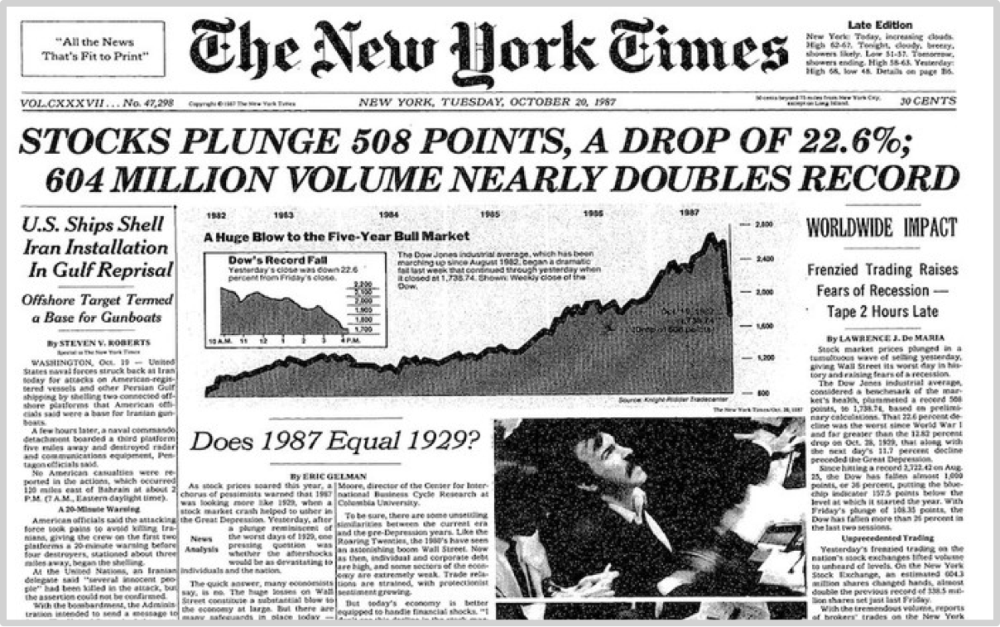
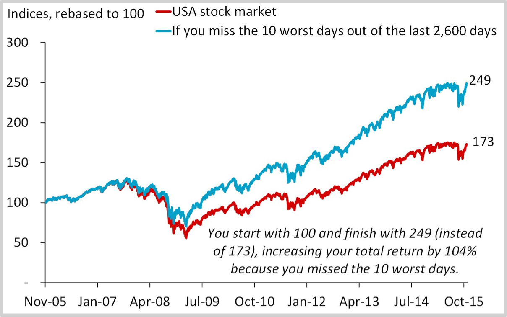
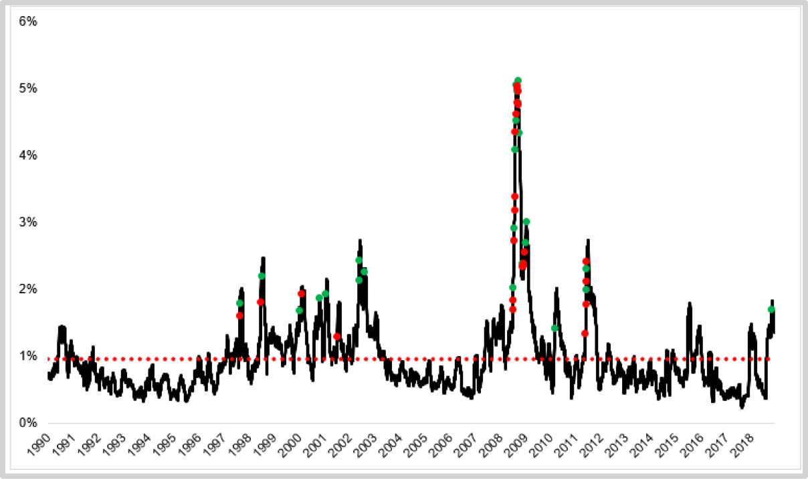
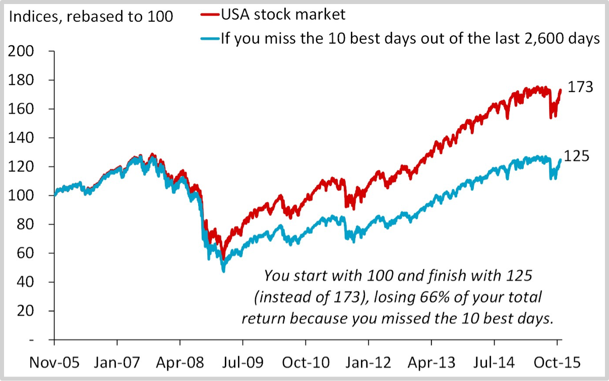
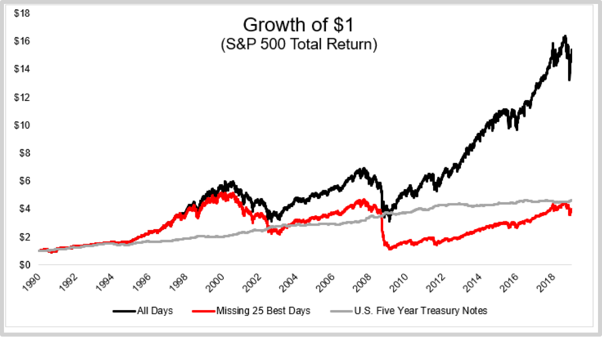

### 3.2走过路过不要错过

“[**黑色星期一**](https://en.wikipedia.org/wiki/Black_Monday)”的说法缘起于1987年10月19日的突发股灾，当日，道·琼斯指数突然急转直下。从年初开始的十个月左右的时间里，道·琼斯指数一路上扬了38%；不料，到了这一天，道·琼斯指数一日之间跌去了22.6%！全球民众在直播电视中陷入了恐慌，在此之前，历史上从来没用过这种“全球所有人都在同时眼睁睁看着正在发生在自己身上”的灾难。

这场源自于香港很快蔓延全球的经济危机让人们不由自主地想起远在1929年的10月28日，同样也是星期一，股市开始崩盘……事实上，差不多二十年过后，到了2008年9月29日，随着美国房产泡沫的破裂，又是星期一，股市崩盘，引发了2008全球经济危机。2015年8月25日，也是星期一，中国股灾爆发，上证指数一度暴跌8.5%——要知道中国的股市是有涨停跌停保护的，整个市场暴跌8.5的意思是说，一千多支股票同时跌停！

有天堂就有低于，反过来，如若没有那么可怕的地域存在，天堂恐怕也不会那么令人向往。

人们会不由自主地想，如果我居然成功地避开了股市里最糟糕的日子，那该有多好！那何止是好啊，那应该是再好不过了！有人在2015年做过统计，在此之前的2,600天里，如果你竟然可以避开10个最差的日子，那么，你的收益可能增加104%！（参阅IESE商学院的教授[贾维·埃斯特拉达](https://www.iese.edu/faculty-research/faculty/javier-estrada/)的相关论文：[Black Swans,market timing and the Dow](https://pdfs.semanticscholar.org/9c64/3d7ed23a1ecdb862a169ff8654e9d1fd15ef.pdf)）

当然，估计你也同时意识到了另外一个事实：那就是你根本无法做到如此精准地避开所有最差的日子……这就好像生活中无论如何你都会遇到很多次没带伞却遇到了大雨的情况一样——除非你很小就夭折了。

即便你真的做到了，你还会遇到另外一个尴尬的事实：

> **最好的日子通常是紧挨着最差的日子的……**

如果你真的避开了所以最坏的日子，那么你就会不可避免且有“神奇地”避开了很多最好的日子。[以下图示](https://theirrelevantinvestor.com/2019/02/08/miss-the-worst-days-miss-the-best-days/)中的红点是最差的日子，绿点是最好日子：

来自**[JP摩根的统计](https://www.businessinsider.com/cost-of-missing-10-best-days-in-sp-500-2015-3)**告诉我们，10个最好的日子中，竟然有6个发生在那些最差的日子之后的两周范围之内。如果你在10年时间里错过了10个最好的日子，你的收益会受到怎样的影响呢？

错过10年之中最好的10个日子的结果时，将有*66%*从你的收益当中消失不见，即，你的γ是*66%*——另外一项统计告诉我们，从1990开始算起，错过这期间25个最好日子的结果就是到最后你的投资还不如五年国债的收益呢——如下图所示。

那么，对策是什么呢？对策就是不动，正所谓“**无为而治**”——千万不要低估“无为”的力量，除了交易市场之外，真的很难再找出另外一个地方可以让我们如此直观地感受无为的力量了。

相对于价格大涨的时候，媒体总是在价格大跌的时候更为活跃，因为惊悚的标题和内容熊市能够吸引更多的流量。媒体总是更倾向于报道坏消息而不是好消息。除了坏消息更容易吸引流量之外，还有另外一个原因在于，报道坏消息好像更符合媒体的自身形象，毕竟，媒体在报道他人好消息的时候总是有捧臭脚丫的嫌疑。2017年4月的美联航事件（这是个坏消息）获得关注的期间，“沃伦·巴菲特的资产一日蒸发约两千万美元”（这也是坏消息）之类消息铺天盖地，可是，“沃伦·巴菲特当然在航空板块的总体收益在市场恐慌中事实上超过一亿美元”这样的标题和内容就完全缺席。

在市场中，频繁交易者们总是显得更容易大惊小怪。这也很容易理解，因为他们时刻关注价格变化，所以他们的情绪波动相对于长期持有者自然更为激烈。每次价格下跌的时候，你就会在各种网络聊天室或者论坛上看见他们大喊，“暴跌啦！”可是，等价格上涨同等幅度的时候，你却完全看不到那些曾经四处大喊暴跌的人们——为什么呢？

行为心理学家的解释是这样的：人们厌恶损失，遭受一块钱损失的痛苦远远大于获得一块钱收益的快乐，所以，当同等幅度的上涨发生之时，那些人并不会像之前那么激动。这个解释当然有一定的道理，然而，李笑来有一个很可能更贴合实际的解释：

> **那些忍不住四处大喊“暴跌了”的人是挺不过去的，他们百分之百会因为极度的恐慌进而早就抛出了手中的筹码。所以，等“暴涨”的日子紧随其后来临的时候，他们手中的筹码早就输掉了，或者干脆早就已经退出了市场，所以他们事实上喊不出来了。就好像鬼故事里发生的那样，他们在另外一个世界里就算大喊，这个世界的人们已经根本无法听到他们的声音……**

绝大多数首先冲进市场的人不懂得定投策略——事实上，他们没有任何策略，他们冲进市场的原因就是看见了别人的好日子。这也是他们之中的绝大多数注定会黯然离场的根本原因，因为好日子总是很少，坏日子总是相对更多——可是，在这种情况下市场长期来看依然上涨的原因就是，虽然好日子相对较少，但好日子里的累计涨幅远远超过坏日子里的累计跌幅……可问题在于，基于当下的事实做判断是绝大多数人天然的倾向，而基于长期的视角做宏观观察是只有少数人受过良好教育之后还要长期践行才能真正获得的能力。

定投策略的最终成功，主要取决于以下要素：

> - 定投标的的谨慎选择
> - 定投计划的彻底执行

定投策略是一个相当优秀的策略，简单直接粗暴有效；可是，少见有人用它获得成功。其中一个重要的原因在于，新手刚刚入场的时候，往往并没有能力甄选最优定投标的，所以在十有八九的情况下，他们能做的只能是“盲从那些已经展现**长期**成功业绩的真正成功投资者的建议”。他们自己也知道，只有这样做，他们才有可能获得更多的α……但是，盲从者有另外一个天然缺陷，那就是他们会因为事实上的无知而无法做到坚定。就好像是人们开车在路上遇到的情况一样，总是感觉自己所处的车道比别的车道更慢，于是，总是忍不住想要换一个车道——而后依然会发现自己所处的车道比别的车道更慢……

定投策略采用者，由于他们从进入市场开始就只有一个动作，买，所以他们肯定经历了所有的坏日子，当然包括那些最坏的日子，但，也恰恰因为如此，他们不会错过任何一个好日子——再一次，定投策略之所以有效，就是因为它天然百分之百与现实的真相相符。