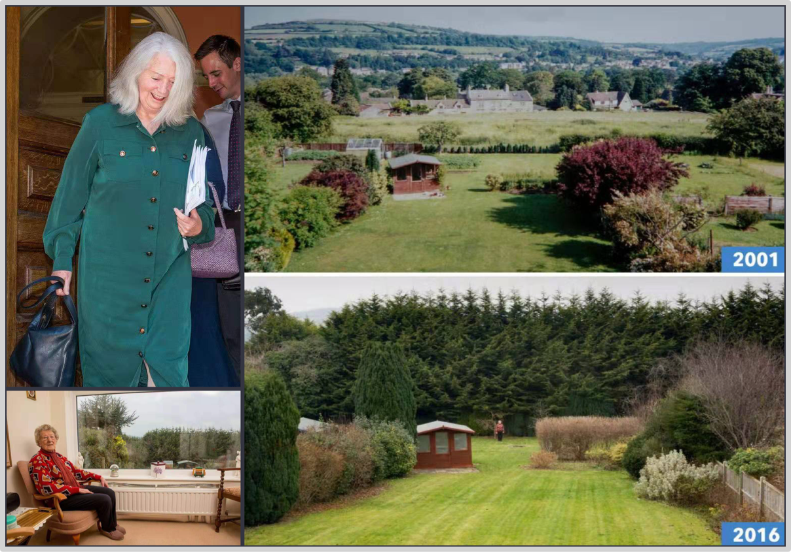
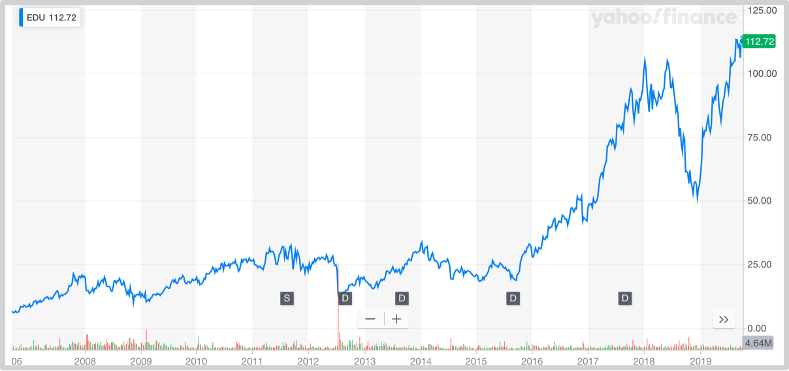

### 3.5定投执行各个阶段

市场里的交易者几乎都遇到过一个魔咒：

> **我一买它就跌……**

这其实不是人们以为的玩笑，或者是“我太倒霉所以才遇到”的情况——他就是事实。原因其实很简单，“连你这样一个外人都被吸引进来了，那说明这牛市也快到头了……”绝大多数情况，人们都是被上涨的价格吸引进市场的，所以“我一买它就跌”，并不是魔咒，也不是某个人单独遇到的坏运气，而是几乎所有人都会遭遇的普遍且又必然的现象。

所以，不管你是否采用定投策略，你冲进市场的第一阶段，几乎必然是一个漫长的**低谷阶段**。

我喜欢看产品说明书。拿来一个陌生的东西，有个产品说明书就很幸福。你读着读着就知道了一个新的功能，一个新的用法……在很短的时间内你就能完整地掌握一个新东西的各种用法，那种感觉真的很棒。

可惜，投资没有说明书。事实上，我们这一生所遇到的最重要的东西都没有说明书，结婚的时候没有人能给我们一个清晰明了的婚姻说明书；生孩子的时候也没有人能给我们一个养儿育女说明书；当然，当初我们出生的时候，不仅我们的父母没有子女说明书，直到我们长大成人，父母和我们一样，依然没有人生说明书……

不过，人类之所以与其他动物不一样，最重要的方面就在于人类有语言和文字，所以人类在出生的时候事实上并不是从零开始——因为只要习得了文字，只要开始阅读，那就相当于“已经站在了巨人肩膀之上”。

但是，为什么明明大家都可以站在巨人肩膀之上，可最终绝大多数人都活在巨人脚趾之下呢？最佳解释就是，绝大多数人在起初的时候过早放弃了事实上是最佳的策略：**盲从**——这是我们在第二部分第一节中曾经深入展开过的话题。过早独立思考虽然也许是好事，但更可能是坏事——因为独立思考并没有多少价值，建立在见多识广上的独立思考才真正有效，可问题在于早期的时候就是见识少啊！在很局限的见识基础上再怎么独立思考依然是坐井观天。

盲从策略的实施，对成年人来说尤为不易，因为在此之前你已经为独立思考奋斗了很久，现在竟然要退回去，颇有些难堪。这里就需要一个很小的技巧，或者可以被称为“花招”：

> **你可以独立思考，但你只能把随后的行动只落实在纸面上——也就是说，你可以用一个专门的本子记录你的独立思考，但在行动上，依然保持盲从。**

在投资领域之外，你不一定要这么做；但，在投资领域之内，你必须这么做！因为这不是你可以随便试错的领域，这里的每一次错误都会导致真金白银和更为宝贵的时间上的损失。你那很可能只不过是尚未被验证为愚蠢的新鲜想法，其实并不值得你用真金白银和你自己宝贵的生命去验证。

> **认真观察他人的决策和结果，从他人的错误中及时汲取必要的经验和教训——并且记录到纸面上。**

看他人犯错，看他人付出真金白银的代价，看他人用他们自己宝贵的生命去做验证，虽然看起来颇有些讨巧，可它偏偏却是提高见识的最佳途径，没有任何一个其他途径可以使你变得更加“见多识广”。很多年来，我最喜欢的消遣之一，就是在各种在线聊天室或者在线论坛上看那些陌生人发表见解，我会做很多笔记，是不是拿出来看，对我的进步有着不可或缺的巨大的帮助。

由于入场时机更可能是最差的时间，又因为低谷阶段天然很长，进一步刺激了另外一个天然的倾向：人们在遭遇损失之时有强烈的改变欲望——我们人类的大脑不是为了投资而涉及的，是千百年来为了挣扎着生存而设计的。所以，在这个阶段里，只有一个办法低于那些来自于四面八方无畏挣扎的欲望：

> **磨炼自己的长期视角。**

有一则2017年的新闻故事。有两个英国老太太于20年前产生了激烈的纠纷。维拉瑞·薇薇安想要在自己大院里新盖个房子，可贝蒂·凯莉一家却联合邻居一起反对——因为若是那房子建起来的话，凯莉家里那大窗子的视野就被挡住了。为此两家甚至闹上了法庭——最终，薇薇安没有获得建新房的批准……

薇薇安从法庭回来做了什么事儿呢？默默地在两家大院交界的地方种了一批树苗……5年后，2001年，那已经是一排小数；15年后，那可是薇薇安刻意挑出来长的速度最快的树种；那一排树墙已经高达二三十米！上图左上角是20年后两家在此对簿公堂，薇薇安胜诉而归的笑容。薇薇安怎么赢的？她在20年前就赢了——只不过，贝蒂·凯莉一家需要等很久才知道他们早就输了，且输得相当彻底。诸葛亮决胜千里之外，薇薇安好像更厉害，决胜廿年前。这廿年之中，薇薇安每天有胜利相伴，一定比其他人更多那么一点点快乐和幸福。

虽然天气预报总是出错，但，对于未来，有一些事情是百分之百确定的——比如，若是你种下一棵树，那么未来它一定能长高。定投策略采用者就是这样的，他们的投入相当于是在种树，四五年看不出什么，但在十年二十年（或者说两个大周期）之后，当年的种子一定会长成参天大树。

在漫长的低谷阶段过后，会迎来下一个阶段：**第一次收获**。

虽然这个阶段注定会非常短暂，可它事实上是最难安全度过的。首先，你会发现突然之间你所在的世界喧闹了起来，不仅尾部呱噪，你自身也开始产生各种幻觉。最常见的幻觉就是你会觉得自己的智商提高了！不仅如此，你的智商正随着急速上扬的价格而迅速提高！你的说话声音开始大了起来，你的语调变的更加铿锵有力，并且，你身边的人会不会不由自主地附和你所说的一切……在这种情况下，你只能越来越自信。

自信这东西，多少有一点肯定是好事儿；但它哪怕只多了那么一点点就会自动使人的智商降低为零。随着过度自信的程度增加，智商甚至会事实上沦为负数。你会开始做各式各样的蠢事，生活花销突然加大之类的都不在话下，最隐蔽的愚蠢是，一方面放弃了之前的长期时间投入，另一方面也同时放弃了未来相当长一段时间的继续投入。你忘了，在这个时候你所放弃的，在下一个大周期过后会被放大更多倍。人们会在这个阶段，花费一个岛价钱买一辆所谓的豪车……你以为你是在一掷千金，可实际上你是在一掷千年！那些在未来你原本可以赚到的钱，因为你这个时候的愚蠢，再奋斗一千年也不可能赚到……

不过，相对于另外一个愚蠢，上面提到的什么都算不上。在这个阶段少数有上进心的人偏偏因为他们有上进心所以会犯一个更为愚蠢的错误：他们开始疯狂投资。他们的出发点是积极的，他们相对更为上进，并且投资当然是好事，而且投资是为了更上一层楼，这是相对来看只有很少的人才有的积极态度。可问题在于，他们智商并没有真的提高，他们的见识就算有所拓展却也依然事实上并不够用，于是，他们几乎无一例外都将遭遇“凭运气赚到的钱凭实力全部亏掉”的结果。

这样的时候，有一个心理现象隐藏在背后作为催化剂：横财效应（House Money Effect）——在赌场上，赌徒们会不由自主地把赢来的钱不当钱花……自己曾经带去的钱，无论如何都会被当作“辛辛苦苦赚来的钱”，但，赢来的钱，金额越大，越不是“辛苦赚来的钱”，而是“横财”。横财这个东西，花起来是没有任何心理负担的，甚至，它就好像烫手山芋一样，让人感情必需甩出去——绝大多数没有上进心的人，用它来随意挥霍；极少数居然有上进行的人，用它来做事实上不负责的不合格的投资。

这个阶段最锻炼一个人的**无为能力**。在这样的时候，什么都不做是一种能力！无为而治莫过如此。定投策略者相对更容易做到的原因在于，他们有“在交易市场内除了买之外什么都不做”的能力，甚至，那相当长时间里可以培养的习惯。更何况，定投策略者有更重要的事情需要忙活——在场外继续赚钱……并且，由于价格上涨了，所以，他们所需要的场外赚钱能力应该更强才对，于是，他们忙着自己真的进步呢，很难产生什么幻觉。事实上，场外赚钱能力促成检验一个人是否真的进步的最靠谱方式，因为在场外，你没有趋势加持。场内是拼交通工具的地方，场外是拼脚力的地方。

短暂的第二个阶段过后，你会迎来最难熬的第三个阶段，即，**第二次低谷。**人们赚到一块钱的快乐远不如损失一块钱的痛苦——这是所有人都有的天然倾向。这个阶段依然漫长，甚至更加漫长，因为这一次你只能“从头至尾”地经历这个阶段，而非像第一次那样，很可能只经历了“部分低谷”——因为你是被那个漫长阶段中的某一次阶段性大涨吸引进市场的……

在这个阶段里，你能够感受到的损失，跟第一次低谷阶段最大的不同在于，这一次，你正在经历的是已经被放大了好多倍的损失。不仅如此，你的想象力因为你正在感受到的是被放大的损失而进一步被放大，你的脑子里充满了这个句型：

> **要是……就好了！**

比如，“要是一月份清仓了，现在就可以住在比现在大三倍的房子了！”或者，“哪怕上个月清仓，老婆就没什么理由跟我吵架了！”等等，诸如此类。更为可怕的是，会有层出不穷的巨大差异比较，“你看，那谁谁早就跑了！”

其实，换个角度你就释然了。这就好像你刚刚驶船从小溪进入大江，你要重新经历一遍你曾经经历过的，只不过，这一次波浪更大了一些，甚至大了许多！曾经在小溪里晕船的你，再一次不适应，所以还是会晕船，还是要大吐很多次……但，你终将会再次适应的，就好像当初在小溪里驶船都晕水的你现在早就没事儿了一样。这时候你需要反复提醒自己的是，这才哪儿到哪儿啊？继续航行下去，你会冲进大海，哪里的风浪更大，到时候，你还是要再重新适应一遍的……

到了这个阶段，你必须重新建立你的一个世界观：

> **每一个终点，都是新的起点——除非你死了，或者你自己主动选择死掉。**

以终为始，是任何一个长期持续成长的人都具备的一个基本观念。我在新东方工作过七年（2000~2007）——2006年，新东方在纽交所（NYSE:EDU）。我亲身经历了一个事实上常见的现象，一家公司上市之后，大部分人对选择尽快套现而后离开——因为他们就是那种属于大多数的，认为终点就是终点的人。事实上呢？

在不计算分拆不计算分红的情况下，过去的13年里，新东方股票为投资者创造了高达*26.2%*的年化符合回报率！也就是说，那些上市之后第一时间就套现的人，在奋斗13年之后发现自己的成绩不会这么好的——尽管在这个过程中新东方股价有起起伏伏，经历了若干次的“暴跌”——26.2%的这个成绩，甚至比沃伦·巴菲特还强一点点，话说，到最后，有几个人真的能跑赢沃伦·巴菲特呢？

从这个角度望过去，我的前老板俞敏洪就是这样一个楷模，他做到了把每一个终点都当做新的起点，而后继续走下去……哪怕遇到下一个终点，对他来说，那再一次是另一个新的起点。在过去的13年时间里，包括再往前的6年左右，我都见过无数的人从各个你能想到的所有角度批评过他，可事实上，从这个角度望过去，那些曾经批评他的人几乎都一无是处。

等这个阶段终于“熬”过去，你终于迎来了下一个阶段，**下一次收获**——这一次，你冲进了星辰大海。也许你会意外，虽然这里的大风大浪比你当年在小溪时、在大江大河时所想象得更为厉害，但，一路走过来的你却事实上很平静。一路走过来的我对自己的平静就感觉很意外。然而，很快就发现这才是正常的。你若是像我一样天天看到的都是那些其实是在小溪里驾船行驶的人每时每刻都好像是在经历大海里的狂风骤雨一样反应激烈，你没办法不平静。

到了这个阶段，很可能有一样东西让你无法平静——那就是你依然尚未找到值得你持续努力的目标。想象一下，你既然拥有了很多财富，却尚未找到人生的意义，那有多可怕？我个人最大的幸运在于，即便是在我的鸡蛋清都没准备好的情况下，我就已经有了值得终身去做的事情：学习与成长——事实上，很多急着在采访我的时候都用奇怪的眼神直白地表达过他们的难以置信。然而，请你理解一个清楚地了解自己天分原本不佳的人通过长期持续学习获得不断进步之时他所能感受到的那种激动和幸福。

许多年前，我就发现一个简单的道理：

> **教是最好的学习方法。**

于是，我喜欢做教育，迄今为止，我已经“一不小心”从事了二十年的教育工作——教人考试，教人写作，教人创业，教人投资……教育，就是我至死都能做，且极其乐于做的事情，了不起换个领域继续教下去，因为反正我要继续学下去，就这么简单。根据我的体会，**找到值得自己终身去做的事情，是一个人最好的护身符**。现在的李笑来，经常在网络上给几千人（将来人数会更多）讲课——早上起来讲十分钟课，李笑来很幸福。人做的事越大，麻烦越大，可是，对李笑来来说，没有什么烦恼是讲十分钟课不能化解干净的。

[**返回首页**](./index.md)
