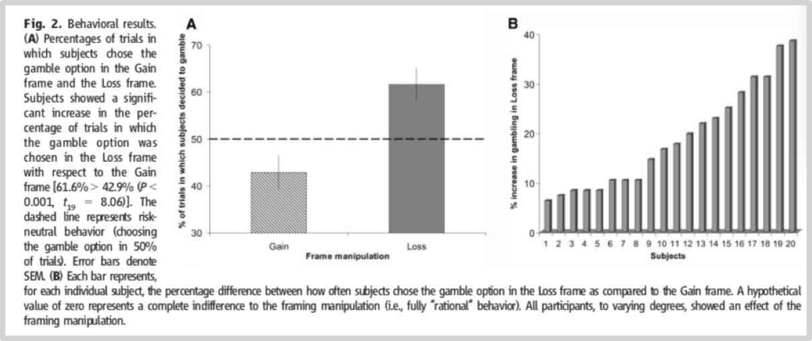
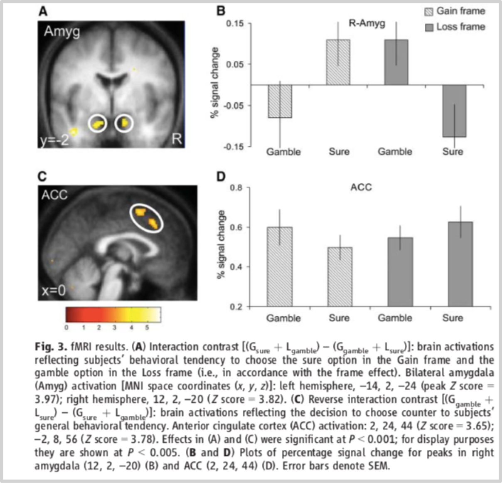

### 4.1我们就是非常不靠谱

多年以来，全球所有心理学家们的研究结果通常会让令我们非常绝望。在过去的几十年时间里，来自世界各地的调查研究均向我们展现同一个结果：作为人类， 我们的决策质量总是非常差，就是因为我们从里到外彻头彻尾地不靠谱……

2002年获得诺贝尔经济学奖的[丹尼尔·卡尼曼](https://en.wikipedia.org/wiki/Daniel_Kahneman)和他的合作伙伴[阿莫斯·特沃斯基](https://en.wikipedia.org/wiki/Amos_Tversky)很早就发现人们极度厌恶损失——之前我们就提到过好多次，人们损失一块钱的痛苦远远大于赚到一块钱的欢乐……乃至于人们甚至仅因为说话方式的不同就会做出实际上完全没必要的所谓选择。比如，被测试者会收到一笔钱，例如50英镑，然后这些测试者被告知他们可以进行选择：

> - 收益框架：你可以保留这50英镑中的20英镑。
> - 损失框架：你将会失去这50英镑中的30英镑。

其实，这两个选项是一样的，因为无论哪一个选项，被测试者最终都一样，收到的都是20英镑。结果呢？结果因为第二个选项是损失框架，所以，同样的情形用损失框架描述的时候，被测试者更可能被引发损失厌恶情绪。

关键在于这里：他们的这种“凭空产生”的情绪会使得下一步的决策受到影响。班纳德图·马蒂诺（Benedetto De Martino）在[一篇论文](https://www.ncbi.nlm.nih.gov/pubmed/?term=De%20Martino%20B[Author]&cauthor=true&cauthor_uid=16888142)里描述了他与合作者们共同设计的一项实验。上面刚刚提到的，就是被测试者们所做的第一个所谓的“选择”。

这个实验聪明的地方在于，实验设计者并没有打算就此结束，他们想要观察更进一步的影响和结果。于是，他们设计了下一个选项：

> **无论研究人员究竟是用哪一种语言框架向被测试者描述选项，即，无论是用收益框架描述，还是用损失框架去描述，被测试者都要进行下一个选择，那就是他们要不要用那些钱去参加一个损失概率明显大于收益概率的赌博……**

并且，为了更为客观，得到更为准确的结果，实验设计者们向被测试者尽量详尽地解释了各种选项，包括框架效应的存在，包括赌博输赢的概率等等……

然而，研究者们发现，那详尽的解释好像没有任何用处，大多数人还是会被框架效应所影响，也就是说，最终，在实际上同样的两个选项之中，虽然经过详细解释，还是有更多的人选择了收益框架——并且比例也没有什么太大的变化。

更为严重的是下一个结果。无论是选择了收益框架的人，还是选择了损失框架的人，都有一部分选择了下一步，即，用那些钱参与明显坑输掉的赌博。只不过，选择了收益框架的人群中，选择下一步去赌博的仅占43%，即，低于一半；但，选择损失框架的人群中，选择下一步去赌博的人占了62%，多了一半……这就有点严重了，一个“凭空产生的选择”以及一个“因此凭空产生的情绪”，会导致很多人竟然不惜去参与明显更可能输掉的赌博！

原来会有这么多人只因为害怕而去冒险！——换言之，原来很多人之所以肯于冒险，根本就不是出于勇敢！并且，他们害怕的东西其实并不存在……

还没有结束……

最有趣的是实验之后的访谈。被测试者大多都会承认自己的决策依据前后并不一致，尤其尴尬的地方还在于，这些被测试者面对测试结果的时候，心里明明记得自己在进行决策之前听过对各个选项的详尽描述，然后又刚刚经历了自己的清醒而又糊涂的决策过程及其结果，所以大多数人都觉得自己有些莫名其妙，他们的解释大致是相同的：

> **虽然我知道，但我就是控制不住自己……**

这太可怕了——明明知道怎么回事儿，却就是控制不住自己。

这个实验的结果，令我们这些严肃投资者目瞪口呆！何止是目瞪口呆啊，是心惊胆颤吧？甚至干脆是魂飞魄散，犹如惊弓之鸟一般……为什么，因为我们可是拿着自己的钱在做事啊，而且不是20英镑而已；并且，不仅拿着今天手里有的钱，还拿着自己相当长一段时间的未来时间以及那一段未来时间里能够赚到的钱去做事啊；再进一步，我们不仅要做事，还要做成事，我们想的可不是作死啊！你说，拿着自己的钱，拿着自己的未来，眼看着正确的目标……可在走向目标的过程中却出现，“我全都知道，可就是没办法控制自己，控制不住自己走向灭亡，控制不住自己去选择走向灭亡”，还有比这个更可怕的事情嘛？这完全是个鬼故事啊！吓死人的鬼故事。历史上，所有的鬼故事都是一样的，不管是什么样的文化，东方还是西方，不管是什么样的年代，古代还是现代，都是一样的，所有的鬼故事的核心，一句话就能概况：那就是故事里的主角，基于种种原因，眼睁睁地看着自己走向灭亡，全程清醒，却又无可奈何，就是控制不住自己……

这个实验精彩的地方还没结束呢。在被测试者经历各种决策的过程中，研究人员还同时监测了被测试者的大脑活跃情况，使用了功能性核磁共振成像技术，即，所谓的[fMRI](https://en.wikipedia.org/wiki/Functional_magnetic_resonance_imaging);然后看到了惊人的现象。

这张图基本上揭示了“我就是控制不住自己”这种见了鬼的现象究竟源自于什么东西。

从实验的结果来看，当被测试者没有能够抵制住损失厌恶的时候，他们的杏仁核处于激烈激活的状态。杏仁核是什么东西？我们的大脑里这个杏仁核是大脑边缘系统的皮质下中枢，有调节内脏活动和产生情绪的功能。它会引发应激反应，进而让动物能够挺身而出或是逃避危险。杏仁核体积非常小，但它对情绪反应十分重要，尤其是恐惧。

你回忆一下自己经历过的深度恐惧，就会发现当恐惧发生的时候，你的害怕不仅体现在情绪上还体现在生理上，并且生理反应非常严重。你会感觉到自己的心脏被提了起来，会感觉自己的胃空空的，很难受，会冒汗。你会感觉自己的大脑一片空白——那是因为你的大脑皮层正处于缺氧状态。这个杏仁核的应激反应，就是那个最终左右被测试者选择的东西；这个杏仁核的应激反应，就是被测试者口中“我明明知道自己该怎么办，可我就是控制不住”的那个东西。

还有更令人绝望的呢？更令人绝望的是，他们都有死不悔改的倾向，当自己被证明错误的时候，反倒会让我们变得更加顽固……读到这里的时候，我猜所有人都会有一个闪念，“难不成我也是这样的吗？”——我替你回答吧，你是，你就是！因为我们 所有人实际上都这样，只不过程度轻重不同而已。

弗兰西斯·培根的观察是：

> **只要人们持有一种见解，不管是被植入的还是真心认同的，他们就会想尽一切办法使用一切可用的手段去维护它……**

当这种见解被证明为错误的时候呢？[纳西姆·塔勒布](https://en.wikipedia.org/wiki/Nassim_Nicholas_Taleb)的观察是：

>  **他们绝不反思，绝不深入研究，他们的尴尬与难堪将使他们用各种理由去继续维护他们的观点；即便是认错，也只是停留在向人解释自己为什么出错上，而不是改正错误之后在正确的方向上继续前行……**

丹尼尔·克罗斯贝在他的《行为投资者》中引用了两个例子，一个是关于塑料袋争议的，一个是关于枪支管制争议的：

> - 制作纸袋比制作塑料袋耗费更多的世界，前者是后者的3倍；即便是在大量宣传之后，其实也只有24%的人使用纸袋，与此同时，事实上有67%的人重复使用塑料袋；纸袋生产比塑料袋生产产生的空气污染多70%；回收纸袋比回收塑料袋耗费的能量多91%……
> - 98%的犯罪使用的是偷来的枪支；每年超过10万人用枪支成功保护了自己的安全；90%的情况下枪主在保护自己的时候并没有真的开枪；从1980年到现在，每年不小心被水淹死的人都比死于枪支的人更多；每年死于餐刀的人数竟然十倍于死于枪支——餐刀才是更为方便的凶器……

不管你属于哪一派，不管你是支持使用纸袋的还是支持使用塑料袋的，也不管你是支持枪支管制的还是反对枪支管制的，这都不重要——在这里重要的是，你能观察到的，各自对立的两派之间争斗的激烈程度。如若仔细观察，最终你会惊讶于那些争论的激烈程度本质上与事实全然无关，大家好像完全不在乎事实，大家在乎的是自己的输赢。事实和数字本身并不能改变人们的立场。赢了，继续打，输了，坚决不认，还要继续打……到最后，不小心看到了事实，会被事实打败吗？不会，他们会继续寻找其他能够支持自己的事实。

这种挫败之后信念却越发强烈的现象，在心理学上有个专门的名词，叫做“[逆火效应](https://rationalwiki.org/wiki/Backfire_effect)”。研究者们对其研究之后的发现更令人绝望——这种逆火效应在“打败他们的证据略显含糊”的时候尤为强烈。比如，那些笃信世界末日的狂热团体成员，在经历了2000年其实平安读过的事实之后，并不会这么想：“哦，原来我们错了，世界末日可能并不存在”；他们真正在想的恰恰相反，他们会说，“谁说世界末日一定要那么准确地降临在2000年？”或者暗自嘀咕，“也许是我们足够虔诚才导致命运不够准确……”

这种逆火效应，以及它那愈挫愈强的属性，在投资领域更为明显。那些对未来作出了不准确预测的人是最明显的例子。错就错了呗，预测总是错的更多……但是，当事实已经证明他们的确错了的时候，由于投资世界的不确定性普遍存在，他们不仅不会认输，还会爆发逆火，“你们等着吧！早晚会证明我才是正确的！”

我们不靠谱的地方太多了，自从1972年前后[丹尼尔·卡尼曼](https://en.wikipedia.org/wiki/Daniel_Kahneman)和他的合作伙伴[阿莫斯·特沃斯基](https://en.wikipedia.org/wiki/Amos_Tversky)开始探究行为经济学领域以来，不仅有行为经济学，后来还有行为金融学，以及行为投资学……科学家们已经分门别类地甄别了超过137个普遍的心理偏差（至2019年；这其中的大部分都可以在[Wikipedia上的一个列表](https://en.wikipedia.org/wiki/List_of_cognitive_biases)中见到），相信以后还会发现更多。

过度自信会让我们出错，维护自我脸面会让我们出错，谈话方式会让我们出错，情绪激动会让我们出错，休息不足会让我们出错，体内糖分减少会让我们出错，甚至连阳光明媚都会导致我们更容易出错；不仅如此，我们对风险的认知永远对不上号；我们对收益的认知总是非常扭曲；手中信息太少我们会出错，手中信息太多我们更会出错……而这个列表事实上可以没完没了。更为糟糕的是，在明明知道道理的情况下，我们还“就是控制不住自己”，在明明已经被证明错了的情况下，我们还可能爆发逆火……

——你说我们到底有多不靠谱？