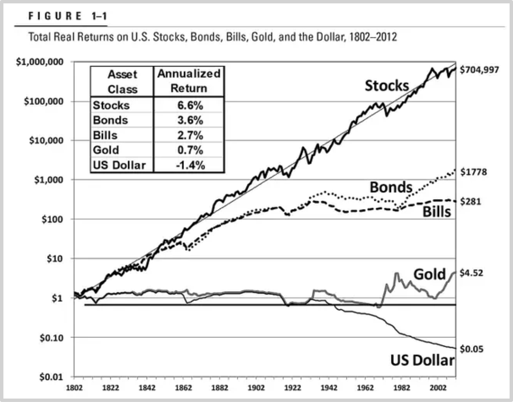
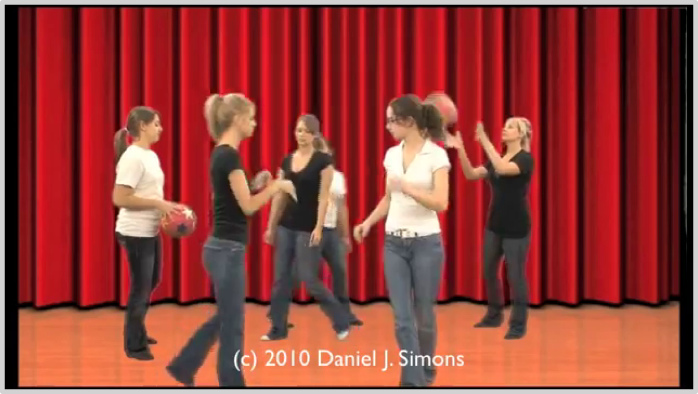
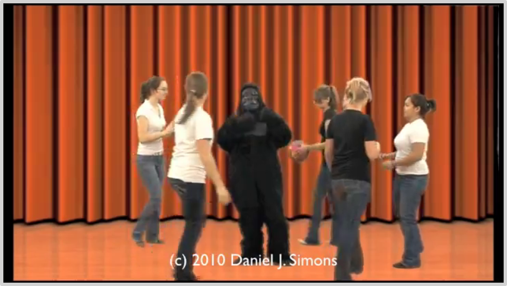

### 4.3长期教育与镜像效应

关于教育，我最喜欢的是这个类比：

> **教育就像一幅眼镜。在戴上眼镜之前和戴上眼镜之后，你其实身处的是同一个世界；但是，戴上眼镜之后你却可以看得更清楚更准确。在受教育之前和受教育之后，你所身处的依然是同一个世界，可是，戴着受教育的镜片，你就是可以把同样的世界看的更清楚更准确……**

多年来，我有搜集类比的爱好。虽然这个类比的出处因为年代久远已经找不到了，但，他就是我最喜欢的类比，没有之一。关于教育的结果，还有另外一个格外精准的类比，是我自己的，我把它称作“镜像效应”（Mirror Effect）:

> 镜子里的世界和镜子外的世界，看起来是一模一样的，可事实上，每一个点都是反过来的……

你看，明明同样是价格下跌，镜子外的世界里，所以的黑马都一样，抬腿就跑，所有的白马都一样，边跑边恐惧，边恐惧边沮丧，至于车夫么，当然因此身不由己……镜子里的世界呢？黑马竟然不为所动，白马竟然欢天喜地，至于车夫么，悠然自得……

在投资领域，随处可见惊人的镜像效应。比如，全球都一样，几乎所有的故事，都被法律要求，必须在显眼处防止风险警告，大致如下：

> **投资有风险！决策需谨慎！**

当然，与之相关的故事，并且还是千真万确的真实故事一直在口口相传：牛顿炒股血亏，丘吉尔炒股惨败，一群诺贝尔奖得主炒股输得天崩地裂……当然，还有很多身边的见识和传闻：某某某炒股失败最后都跳了!

根据JP摩根的统计，从1980年以来，市场上超过40%的股票都曾经遭遇毁灭性打击，即，股价蒸发70%以上……看起来是真的太危险了！然而，沃顿商学院的金融教授[杰瑞米·西格玛](https://en.wikipedia.org/wiki/Jeremy_Siegel)的[数据](https://knowledge.wharton.upenn.edu/article/jeremy-siegel-on-why-stocks-are-and-will-remain-the-best-bet/)却告诉了我们一个截然相反的故事：

杰瑞米·西格尔把历史数据统计了一下，发现的结果是：从1982年到2012年的210年时间里，从任何一个时间点开始截出10年，在*80%*以上的情况下，现金都是股票的手下败将；进而，如果从任何一个时间点开始截出20年的话，那么股票从来都没有输过、现金从来就没有赢过。从实际数据来看，人们普遍以为安全的黄金同样是表现惨烈——与大多数人的直觉相违背的是，人们以为最危险的股票，长期来看表现最好，210年间，年化符合回报率高达6.6%——至于人们总是觉得可以落袋为安的现金呢?竟然是负数，-1.4%看看这些事实和数据，你再想想，到底哪儿的风险更大？股票市场内？还是股票市场外？

> **对了，因为这个“发现”，杰瑞米·西格尔教授干脆写了本书，叫做**[Stock for the Long Run:The Definitive Guide to Financial Market Return & Long-Term Investment Strategies](https://www.amazon.com/gp/product/B00GWSXX26/ref=dbs_a_def_rwt_hsch_vapi_tkin_p1_i0),**到2014年的时候已经是第五版了。**

定投策略采用者的α是在开始行动之前的谨慎选择过程中产生的，一旦行动开始，α就已经确定了，而后顶多通过不犯错去降低γ。杰瑞米·西格尔的结论最令人震惊的意义就是：

> **绝大多数人从一开始就选错了！**

不仅选错，且自信慢慢地选错！这又是一个教育产生镜像效应的惊人例子。明明是同样的东西，人们就是会被分为截然相反的两派，并且，要越是错的离谱越是振振有词地固执……这种惊人的现象是如何形成的呢？关键点在于何处呢？

其实，一句话就可以说清楚：

> **对长期的认知就是那面镜子，总是生成惊人镜像效应的那面镜子。**

几乎所有最惊人的镜像效应，都是因为人们对长期的认知不同造成的。这是永恒的事实：绝大多数人全然没有长期观念，只能看到想到眼前的一切……或者这么说可能你会更容易理解：这个世界上的绝大多数“战车”，永远都是黑马最强大，白马总是随着黑马奔跑，至于车夫么，从来就没有哪怕一点点的成长。

从另外一个角度，你还可以把“长期”这个词想象成一个墨镜，用它过滤掉那些对长期无效的光，就好像戴个墨镜能过滤掉紫外线那样。然后你就会自然而然地、不由自主地更多启用宏观观察能力，就好像四级开车的时候要带偏光墨镜，这样的话，不仅能过滤掉对眼睛伤害最大的紫外线，还可以让那些刺眼的光偏离你的瞳孔……以便你能看的更清楚更准确。

带上“长期”这幅墨镜，再去看看你之前常看的财经媒体，不论是互联网上的文章，还是电视里的谈话节目——仿佛突然之间，你发现自己变了！你看到的都是之前其实看不到的，想到的都是与之前相反的。

节目里有人在讨论市场有效性，两派都很激动，甚至都快吵了起来……换在过去，你很可能会在那里苦恼：你怎么竟然会觉得双方说的都有道理呢？！可是，戴着长期偏光墨镜镜片的你突然明白了，其实这根本就没有什么可争论的，事实很清楚：

> - 长期来看，市场是倾向于相当有效的，放眼越远的长期越是如此；
> - 可是在任何一个单独的时刻，市场总是极端无效的……

然后你就突然开始对“市场有效性”这个概念产生了不一样的喜欢。希望短期市场有效的人越多越好，因为只有这样你才有相对优势——若是市场再是彻底有效，整个市场就没有存在的必要了，因为价格总是与价值相等，于是人们干脆不用交易了……所以，市场正在因为它时时刻刻总是无效，所以才有存在的意义，所以才有我们这样的人可以把握的机会——最幸福的是，因为你总是戴着“长期”这副墨镜，所以你发现，你只需要用时间等待市场终将展现的长期之后的有效性……

一旦你想尽一切办法启用长期观念，最终你会发现“宏观观察的不同”和“宏观观察的简单”，然后你会惊讶于这样一个事实：

> **越重要的问题越容易解决，最重要的问题解决起来最简单——可是人们偏偏要把所有的智慧都用在那些既复杂又无关紧要的地方……**

在第二部分第三节中，我们看过定投策略采用者是如何选择投资标的的，他们比不过是通过几个“大概大概”作出了因为简单只能模糊的选择，然而，他们在未来的收益却在更为确定的透视也更可能更大。市场上的绝大多数其他人呢？他们耗费了大量的时间精力以及他们巢湖寻常的聪明才智，干什么去了呢？他们希望通过眼下可以动用的一切数据（包括历史数据），获得一个最精确的结论——最终，他们的成功率会很高吗？历史反复证明这么做总是徒劳无益。

上个世纪九十年代初，大量的精英离开了中国——三十年后，当然am再回首往事的时候，他们事实上的感受如何呢？很多人的感觉是自己生命中最好的时光里，被掏空了一大块。为什么呢？因为在这三十年间，中国是全球发展最快的地区，水涨自然船高，很多当初相对比较差的人在三十年后各方面的状况都比当初选择离开中国的精英们更好，这让那些既在当初领先又事实上算计更精的人如何面对？更令人难以接受的是，那些当初没离开的人并不是因为不想离开，更多是因为没能力离开……为什么会这样呢？

最佳的解释之中有一个这样的：他们在这么做的同时，由于把所有注意力都放在了当下，所以基本上必定会忽视一些在未来发挥重要作用的原本应该显而易见的事实。有个著名的实验，叫做“[看不见的黑猩猩](https://www.youtube.com/watch?v=IGQmdoK_ZfY)”。在舞台上，有两组人相互传球，你的任务是计数，看看穿着白衣服的那一组人总共传了多少次球：

视频看完之后，也许你能数对，白衣一组总计传球16次……可是，整个过程中，你可能压根就没有注意到有一只黑猩猩缓慢地走过舞台，它就那样大摇大摆穿过舞台，并且还在舞台正中停了一会儿，拍了好几下自己的胸脯！

有些人可能在此之前听说过这个实验，所以在刻意的情况下，既数对了传球次数，又看到了大猩猩——可是，他们全然没有注意到，不知道什么时候开始，舞台后侧的幕布从红色变成了橙色？

事实上，由于我买二大脑就是这样运作的——这几乎没有什么靠谱的解决方案。要么你全神贯注在未来。反正，那时镜子内外的两个世界，总是处处截然相反。当然，杰瑞米·西格尔的研究告诉我们，在赚钱这件事上，只关注未来显然是更划算的。

若是你还能清楚地记得当前章节之前的内容，你会发现很多镜像效应的例子，并且，几乎每一次都一样，那使得一切看起来一模一样可事实上截然相反的镜子，都是“长期”。建议你在重新阅读本书的时候，在笔记本里可以做一个列表，罗列所有在阅读过程中所提到的镜像效应。并且在此之后的许多年里，你还要不断补充这个列表，在这个过程中，你就会发现，那墨镜很可能慢慢变成了“隐形墨镜”……最终，你甚至干脆不需要墨镜了，因为那功能早已内建在你的瞳孔之中。

投资教育的必要性和价值就在这里。你的车夫需要成长，你的黑马白马都需要调教，最终，更好的他们会带你进入一个镜像世界，在那里，无论什么看起来都和外面是一样的，可事实上呢？很可能全都截然相反——可问题在于，那才更可能是客观世界真实的样子——投资的秘诀就在于，对客观世界要有百分之白客观的认知，与此同时，还要对自己有百分之白的客观认知。真的很难。但，说它很难，应该也只不过是当下看起来很难；可也并不是做不到——放眼长期，应该并不难。
