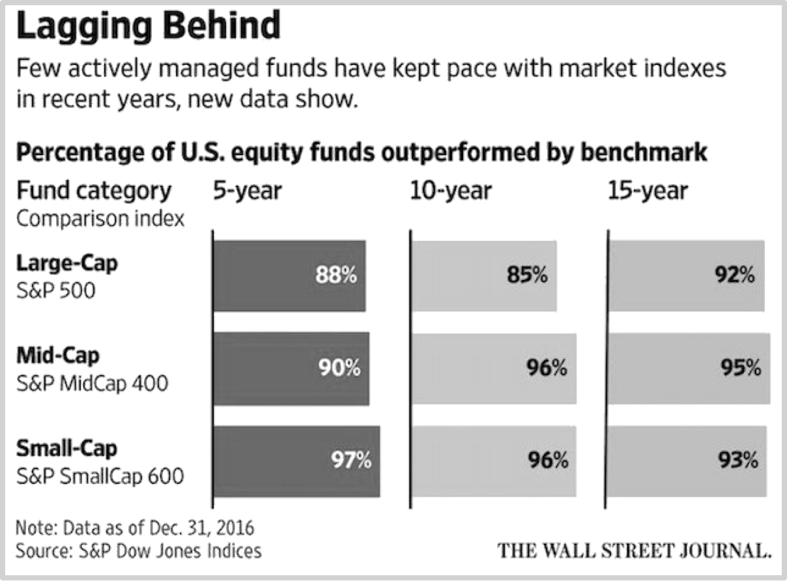
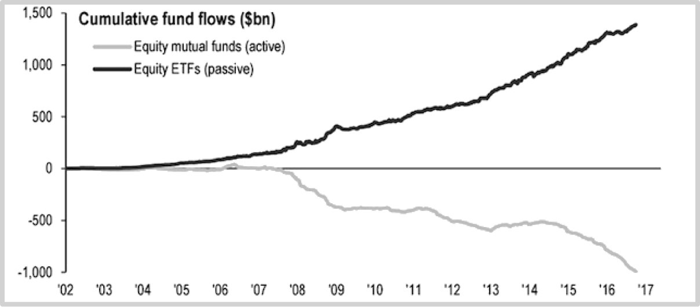

### 4.5主动与被动之间的边界

之前我们提到过：

> **投资的秘诀就在于，对客观世界要有百分之百客观的认知，与此同时，还要对自己有百分之百的客观认知。**

也就是说，成功的投资者要客观认清自己和现实——事实上，还有更为隐秘却又更为重要的地方需要客观认清，**自己与现实的边界。**

我们的身体并不是我们自己与现实的边界——我们确实能在我们身体范围之外做出一些主动的改变。

我们可能拓展我们的身体，比如，使用交通工具，我们延展了我们的腿；使用移动互联网设备，我们延展了我们的神经；事实上，任何一种工具，当我们能够熟练使用之后，都可以事实上成为我们身体的一部分……我们也确实可以影响我们身体之外的一部分世界。比如你要使用自己的信任和尊重换来他人的信任和尊重，比如作为父母你用自己的行动成为孩子的楷模，再比如，在投资领域里你可以用长期持有换来了长期高额回报……

但，通过我们自身以及自身行为能够影响的现实终归有一个边界，在这个边界之内，我们可以通过努力不断进取，但是，在这个边界之外，我们事实上就是无能为力。

如若不能清醒地意识到这个边界的存在，那么，一个人将始终生活在混乱之中，痛苦不堪。

最明显的例子发生在父母教育孩子的过程当中。如果家长们的努力聚焦在把自己变成更好的自己，那么，他们是在在自身的边界之内努力，这很好。可是，绝大多数情况下，你会发现家长们的努力总是用在自身边界之外，也就是他们实际上无能为力的地方。不要以为小孩子傻，他们脑子里就好像有个特殊的雷达一样，凭直觉就可以分清家长是否在说一套做一套；如果家长自己言行不一，那么孩子就会很痛苦，尤其是在他们当然更搞不懂边界的情况下。家长一直入侵，自己又没有防御能力……绝大多数孩子的扭曲反应就是这么产生的，于是孩子很痛苦，与之相对的，这些孩子的家长更痛苦，恰恰是因为他们是在自己明明无能为力的领域里拼命努力，导致的结果当然是屡战屡败、屡败屡战，愈战愈挫、愈挫愈勇，直至双方都筋疲力尽无计可施。

当然，更普遍的例子发生在投资领域之中。投资者真的要参与到经营之中吗？也许罢。可是，几乎可以肯定的是，二级市场中的交易者是不应该参与到经营之中的——事实上，“完全无须参与经营”恰恰是在这里做投资的最大好处。

然而，事实上几乎每一家上市公司的经营者们每天都会收到大量股票投资者来信——email出现之后数量更多，若是开通即时通讯工具，那就得再加上若干个量级——他们整天被投资公司指手画脚，真心诚意地出谋划策，到最后常常会很生气，甚至能实实在在地生气到茶不思饭不想的地步。这些人对自己在边界之外徒劳的事实全然不知。他们不知道在那边界之外，自己的所有努力都毫无用处；若是有的话，只能全都是负面效果。他们也永远不会理解，因为他们根本不可能有能力自己作出一个有效的商业模型最终获得大众的投资。如果他们竟然真的做出来了，他们才会知道，外面那么多人想要影响自己是多么可怕的事情，自己若是那么容易就被外界左右了优势多么更为可怕的事情。甚至可以这么说：一个竟然可以被二级市场随意左右的公司，绝对不值得投资。

让我们在此回顾你的收益公式：

> P=δ+α+γ

等式左边的p(performance)使你最终的投资业绩。等式右边的δ（Delta）是你若选择了与整个市场波动百分百分之百相符的标的，即，β（beta）等于1的投资标的，所能够获得的收益；对定投策略采用者来说，α（alpha）取决于定投开始之前的谨慎选择；而γ（gamma）是因为你自己犯错所以没有赚到的部分。

之前已经有过若干次例证，只要你什么都不做，那么你就不会出错，那么你的γ值就是零，那么你的p就会被最大化。可惜的是，你就是永远都有想要做点什么的冲动，并且时时刻刻都有想要通过做点什么改变点什么的冲动——这没办法，你是人——人类的大脑是为了在险恶的环境中生存而设计的，在过去漫长的若干年时间里，“面对眼前的危险马上做点什么”才是优势策略，“面对眼前的危险却无动于衷”的那些人早就死光了，没有后代。所以说，我们的大脑至今都如此，天然只能理解眼前的风险，无法理解长期的收益——就好像我们在第四部分第三节里所看到的那样，不管210年间的数据如何，绝大多数人仍然相信现金才是真正安全的一样。

但是，如果，你投资了MSCI World指数产品，你有什么可做的呢？你做什么可以影响它呢？你无法改变世界的发展方向、发展进程和发展速度；同样，你也无法改变任何一个国家或地区的发展方向、发展进程和发展速度……同样的道理，你无法改变的还有某个行业或者某些行业，甚至某个公司或者某些公司，无论你是否持有它们的股票——事实上，除了改变你自己之外，你几乎什么都改变不了——越早认清这个现实越好。

地球上的绝大多数基金，都是为了追求α或者追求更高的α而成立的。虽然有明显的成功例子，但事实上成功者寥寥——并且还不能排除他们之中也有运气的加持。比如沃伦·巴菲特，也有显而易见的运气因素：它身在美国，除了美国是过去的55年里全球发展最快的地区之外，还有另外一个因素，美国的法治环境相对最稳定，私有财产相对最有保障。你不妨可以想象一下，沃伦·巴菲特要是竟然出生在韩国的话，现在大概是什么样子？那里是总统和财阀入狱率全球最高的地方。

创造α到底有多难呢？有人开玩笑说，你把股票扔进一个屋子，放一只猴子进去，过一会，把那些猴子在上面撒了尿的股票挑出来形成一个投资组合，最终的结果也能跑赢那些主动基金的基金经理……很不幸，这个玩笑说中了！

根据华尔街日报（2017年4月13日）的统计，截止2016年12月31日，按15年的表现来看，总计有*95.4%*的中型基金落后于S&P MidCap 400，*93.2%*的小型基金落后于S&P SmallCap 600，*92.2%*的大型基金落后于S&P 500……

全都是落后*92%*以上！也就是说，连“徒劳无益的情况十有八九”这种说法都是低估了！于是，以下的资金流向就不足为怪了。

过去的若干年来，全球范围内都一样，被动管理型基金的资金流入量在连年上升；与之相对的，是主动管理型基金的资金连年持续流出。所以说，钱是聪明的，它会自动流行可以让它增值的地方。钱的聪明不仅如此，它也会自动从那些只会用钱消费的人手里流到那些竟然会用钱投资的人手里。

著名神父尼布尔的《宁静祷文》（*The Serenity Prayer*）事实上就是一个对于边界的深刻思考：

> O God and Heavenly Father,Grant to us the serenity of mind to accept that which cannot be  changed;Courage to chage that which can be changed,and wisdom to know the one from the other,through Jesus Christ our Lord,Amen.
>
> > 神啊！
> >
> > 请赐予我宁静，好让我能接受，我无法改变的事情；
> >
> > 请赐予我勇气，好让我能改变，我能去改变的事情；
> >
> > 请赐予我睿智，好让我能区别，以上这两者的不同……
>
> ——译者：洪宋弦

**边界思考，长期视角，宏观观察，**这三个概念组合在一起甚至可以改变一个人的性格。我和我的学生都有这样的感受——虽然人们说性格决定命运，但我更倾向于认为性格这东西不是天生的，性格这东西只不过是黑马白马和车夫不同时期不同能力不同协调程度的综合表现而已。

比如，对这些概念的深入思考，使得我难以愤怒——没有什么事情值得我像年轻的时候那样出离愤怒了。转而，我开始琢磨一个现象：

> **为什么在无论多差的环境里都都是有人可以脱颖而出呢？**

对李笑来来说，定投策略的选择与实施，以及其后能够详尽阐述的能力，就是从自己向自己提出这个问题开始的。启用长期的视角，可以让你得到很多与之前截然相反的结论；宏观观察可以让你作出很多在长期之后结果更佳的选择；对边界的清楚认知可以让你摆脱很多的纠缠，轻松避开几乎所有最终事实上徒劳无益的努力。我没有必要抱怨环境差了；我也不想去抱怨社会不公平——它跟市场一样，只有从长期视角出发来看可能近似公平，可每时每刻，它总是不公平的；最为关键的是，我愈发平静地接受自己总是被低估的情况——跟市场里的价值一样，被高估的时光总是很短暂，甚至干脆可以被称为泡沫，不是吗？

客观很重要。不仅要对这个世界客观，还要对自己客观，更要对自我边界尤为小心翼翼地客观。进而，长期保持客观更为重要。这就是投资的秘密，当然，他就是个公开的秘密。

[**返回首页**](./index.md)
